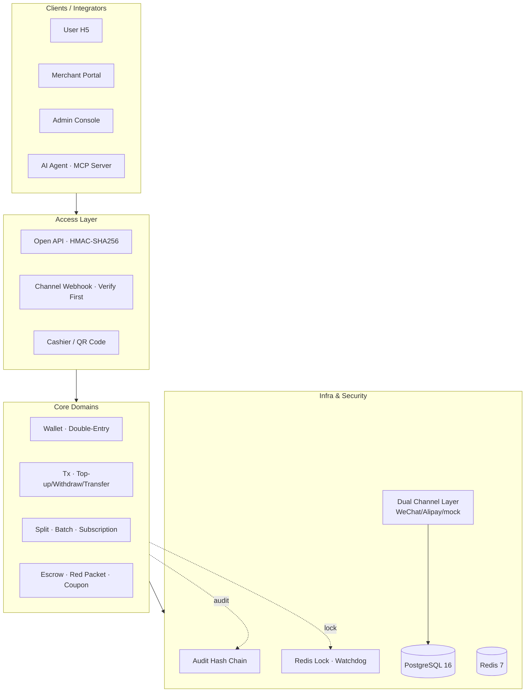
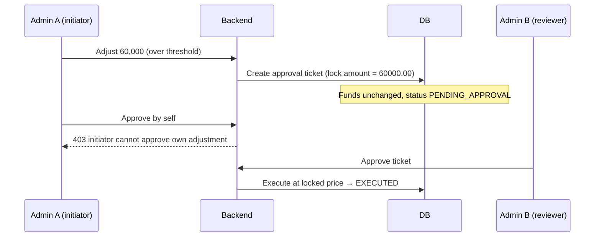

<div align="center">

# 💳 KeBaiPay

**A payment middle-platform that actually runs: wallet, acquiring, open API, reconciliation, and AI agents — five layers, fully wired.**

`NestJS 11` · `TypeScript` · `Prisma 7` · `PostgreSQL 16` · `Redis 7` · `Vue 3` · `MCP`

[](docs/CHANGELOG.md)
[](package.json)
[](docs/CHANGELOG.md)
[](docs/CODE_HEALTH_REPORT.md)
[](LICENSE)

[Quick Start](#-quick-start) · [Architecture](#-architecture) · [Money-Safety Engineering](#-money-safety-engineering) · [Screenshots](#-screenshots) · [Feature Matrix](#-feature-matrix) · [Docs](#-docs) · [Mirrors](#-mirror-repositories)

</div>

---

## 📖 What is this, exactly?

A **privately deployable payment system reference implementation**. Not a toy demo — WeChat / Alipay SDK direct integration, double-entry bookkeeping, distributed locks, idempotency keys, and tamper-evident audit hash chains are all there, the way production systems should have them. **192 OpenAPI endpoints, 41 business modules, 1293 unit tests.**

Three commands and you have a complete system with a wallet, acquiring, reconciliation, and an AI that can help you manage money.

```bash
git clone https://gitcode.com/badhope/KeBaiPay.git && cd KeBaiPay
cp .env.example .env && docker compose -f docker-compose.dev.yml up -d
npm install && npx prisma migrate deploy && npx prisma db seed && npm run start:dev
```

Open <http://localhost:3001>. Test account `13800000001` / `Abc12345` (balance ¥10,000, pay password `123456`); admin at <http://localhost:3001/admin> with `admin` / `ChangeAdmin2026`.

> Pulling slowly? The repo is mirrored on GitCode / Gitee — see [Mirror Repositories](#-mirror-repositories).

---

## 🏗 Architecture



**Four-layer concurrency defense** (the same money is never double-debited or double-credited): a distributed lock prevents concurrent entry → DB transactions handle intermediate states → conditional atomic `updateMany` handles concurrent writes → idempotency-key unique constraints handle retries. Every layer change is covered by tests.

---

## 🎯 What can you do with it

| Who you are | What you get |
|---|---|
| **Engineer learning payment systems** | A complete money-flow template: Redis distributed lock (watchdog renewal) → transaction → conditional atomic update → idempotency key — four-layer concurrency defense; forced balanced double-entry; tamper-evident audit hash chain |
| **Indie dev who needs to collect payments** | WeChat/Alipay/mock connectors, HMAC open API, a zero-dependency Node SDK, ready-to-use cashier and collection QR |
| **Team exploring Agentic Payments** | A built-in MCP Server letting Claude / Cursor safely operate funds on your behalf: scope auth + limits + confirmation + full-chain audit |

### Core capabilities

- **Money-safety engineering** — two-phase withdrawal commit + timeout scan reconciliation, so a crashed process never double-pays; cumulative split overage checks, batch-transfer crash recovery, all edge cases tested
- **Double-entry + audit hash chain** — unbalanced debits/credits roll back immediately; admin actions are fully chained, with `pg_advisory_xact_lock` preventing forks
- **Key governance** — channel credentials stored AES-256-GCM envelope-encrypted; `appSecret` stored as SHA-256 only; sensitive fields masked by a field-name allow-list
- **Dual-abstraction channel layer** — PaymentChannel (official SDK) + Connector routing (retry/idempotency gating); adding a channel means implementing one interface
- **Open API on par with commercial gateways** — HMAC-SHA256 + time window + nonce replay protection + `timingSafeEqual` + exponential webhook backoff + SSRF hardening
- **Multi-channel reconciliation aggregation** — auto pull → match → diff workflow → CSV export
- **AI Agent layer** — Vercel AI SDK against any OpenAI-compatible model; MCP Server in both in-process and standalone stdio forms
- **Observability** — Prometheus `/metrics`, zero-overhead OpenTelemetry, structured logs with end-to-end traceId

---

## 🔐 Money-Safety Engineering (highlight)

Payment systems fear two things most: **money computed wrong** and **interfaces brute-forced**. The capabilities below are implemented and tested — they are the project's core selling point.

| Guard | Approach | Effect |
|---|---|---|
| **Dual approval for large adjustments** | An admin single adjustment with `\|amount\| ≥ LARGE_ADJUSTMENT_THRESHOLD_YUAN` (default ¥50,000) doesn't move money directly — it creates an approval ticket; a second admin approves, then executes at the **locked price** | One person can't unilaterally move large sums; self-approval returns **403**; optimistic-lock claim prevents concurrent double execution |
| **Drop-order self-heal (PENDING auto-reconcile)** | A scheduled job actively queries the channel `queryRecharge` for timed-out top-up orders, sharing the same distributed lock with callbacks | Lost callbacks still auto-credit; **any amount mismatch / missing amount is rejected (fail-closed)** |
| **Unified pay-password / ID-card validation** | 11 entry points reuse the same `@IsPayPassword` / `@IsIdCard` / `@IsSafeText` decorators | One rule, consistent platform-wide, no bypass |
| **Adjustment bounds + credential length** | DTO adds `@Min(-500000)@Max(500000)@IsNumber({maxDecimalPlaces:2})`; 42 credential/internal-ID fields get `@MaxLength` | Rejects sub-fen amounts and out-of-bound adjustments; avoids bcrypt input-boundary DoS |
| **Webhook verify-first** | Signature verification runs **before** the idempotency check; forged callbacks return 400 regardless of order state | Replayed forged callbacks on terminal orders are no longer let through by the idempotency cache |



> There is also one **non-bypassable hard rule** on the money path: the amount returned by a callback / query must exactly match the order amount, otherwise it is rejected fail-closed — no one-sided or mismatched ledger entry ever lands silently.

---

## 🖼 Screenshots


<details open>
<summary><b>Admin Console (10 pages)</b></summary>

| Overview | Users | Merchants |
|---|---|---|
|  |  |  |
| KYC Review | Withdrawal Review | Orders |
|  |  |  |
| Finance | Risk | Agents |
|  |  |  |

</details>

<details>
<summary><b>User H5 (7 pages)</b></summary>

| Wallet Home | Top-up | Red Packet |
|---|---|---|
|  |  |  |
| Bills | Cashier | AI Assistant |
|  |  |  |

</details>

<details>
<summary><b>Merchant Portal (8 pages)</b></summary>

| Dashboard | App Keys | Orders |
|---|---|---|
|  |  |  |
| QR Codes | Reconciliation | Merchant Profile |
|  |  |  |

</details>

---

## 💡 Why it's worth a look

Most open-source payment projects are either SDK wrappers (only "how to call the API") or a payment module inside an e-commerce system (only "how to jump to the cashier"). **Very few actually explain the ledger, reconciliation, risk control, and key governance clearly.**

A few things in this project that may be useful references for you:

- **Concurrency defense is layered, not one lock to rule them all** — the lock solves concurrent entry, conditional atomic update solves concurrent writes, the idempotency key solves retries, transaction isolation solves intermediate states. Each layer solves a different problem, and changing any layer is protected by tests.
- **Double-entry is enforced** — unbalanced books roll back immediately. Many systems' "ledger" is just a flow table; when it doesn't balance, there's nowhere to investigate.
- **The audit chain is tamper-evident** — each log carries the previous hash, with a DB advisory lock preventing forks. Change one log and everything after it breaks.
- **AI spending has gates** — MCP tools aren't "the AI does whatever it wants"; they are scope auth + per-tx / daily limits + confirmation for fund operations, every call on the audit chain.

We're also honest about what's unfinished: **the Stripe / UnionPay Connectors are skeletons**, coverage is 55.6% (a real jest baseline gate since v0.3.1 prevents regressions; target 75% within a year — detailed in the [Code Health Report](docs/CODE_HEALTH_REPORT.md)). Those two are the next focus.

---

## 📊 Feature Matrix

| Domain | Status | Domain | Status |
|---|---|---|---|
| Wallet top-up/transfer/withdraw/bills | ✅ | Multi-channel reconciliation | ✅ |
| Red packet (random/normal/exclusive/code) | ✅ | Escrow | ✅ |
| Merchant onboarding/app/webhook retry | ✅ | Batch transfer + crash recovery | ✅ |
| Open API + zero-dep Node SDK | ✅ | Subscription / split | ✅ |
| WeChat/Alipay official SDK | ✅ | Coupon / referral / invoice | ✅ |
| Dual approval for large adjustments | ✅ | Top-up drop-order auto-reconcile | ✅ |
| AI Agent + MCP + confirmation | ✅ | Stripe / UnionPay Connector | 🚧 skeleton |
| KYC dual-end UI / channel config center | ✅ | Mini-program SDK / multi-currency | 📋 planned |

---

## 📚 Docs

| Getting Started | Deep Dive | Ops |
|---|---|---|
| [Quick Start](docs/QUICKSTART.md) | [Developer Guide](docs/DEVELOPER_GUIDE.md) | [Production Deploy](docs/DEPLOYMENT.md) |
| [API Reference](docs/API_REFERENCE.md) | [Expert Panel & Roadmap](docs/EXPERT_PANEL_ASSESSMENT.md) | [Production Readiness](docs/PRODUCTION_READINESS.md) |
| [SDK Guide](docs/SDK_GUIDE.md) | [Code Health Report](docs/CODE_HEALTH_REPORT.md) | [Troubleshoot](docs/TROUBLESHOOT.md) |
| [User Manual](docs/USER_MANUAL.md) | [Versioning](docs/VERSIONING.md) | [Changelog](docs/CHANGELOG.md) |
| [User Agreement](docs/legal/user-agreement.md) | [Privacy Policy](docs/legal/privacy-policy.md) | [Merchant Agreement](docs/legal/merchant-agreement.md) |
| [Refund & Dispute Rules](docs/legal/refund-policy.md) | [Compliance Statement](docs/legal/compliance-statement.md) | [Commercial License](docs/legal/commercial-license.md) |

- Full OpenAPI 3.0 spec (192 endpoints): [`docs/openapi.json`](docs/openapi.json)
- Merchant 5-step first collection: see [QUICKSTART](docs/QUICKSTART.md)

---

## 🌏 Mirror Repositories

Maintained in parallel across four platforms (same branches, tags and HEAD) — pick any, no favorites:

| Platform | URL |
|---|---|
| **GitHub** | [x33834/KeBaiPay](https://github.com/x33834/KeBaiPay) |
| **GitHub** | [Morningstar202604/KeBaiPay](https://github.com/Morningstar202604/KeBaiPay) |
| **GitCode** | [badhope/KeBaiPay](https://gitcode.com/badhope/KeBaiPay) |
| **Gitee** | [badhope/KeBaiPay](https://gitee.com/badhope/KeBaiPay) |

**🌐 Official site** (GitHub Pages, dual-account deployment): <https://x33834.github.io/KeBaiPay/> · <https://morningstar202604.github.io/KeBaiPay/>

---

## 🤝 Contributing

Before opening a PR, ensure `npm run lint && npx jest --maxWorkers=4` is green. Releases follow the [SemVer discipline](docs/VERSIONING.md); see [CONTRIBUTING.md](CONTRIBUTING.md).

Report security vulnerabilities privately via [SECURITY.md](SECURITY.md) — no public issues.

---

## ⚠️ Compliance

The code is MIT — use it freely. But **the system contains an in-platform ledger; operating it in mainland China involves unlicensed payment business and the "二清" (illegal fund pooling) red line** — that's a licensing/qualification issue, not something a license solves. Only the mock channel is enabled by default, so you can't accidentally run an illegal business.

Before production, read the [Compliance Analysis](docs/EXPERT_PANEL_ASSESSMENT.md) and [Production Checklist](docs/PRODUCTION_READINESS.md).

---

## 📄 License

[MIT](LICENSE) — free to use, modify, and distribute, including commercially.

---

<div align="center">

If this project saved you a few all-nighters, or finally made some money-flow click — **a Star ⭐ is the best feedback**.

Share it with someone who might need it; good things get maintained only when seen.

<sub>Built with care by KeBaiPay Contributors · v0.3.2</sub>

</div>
