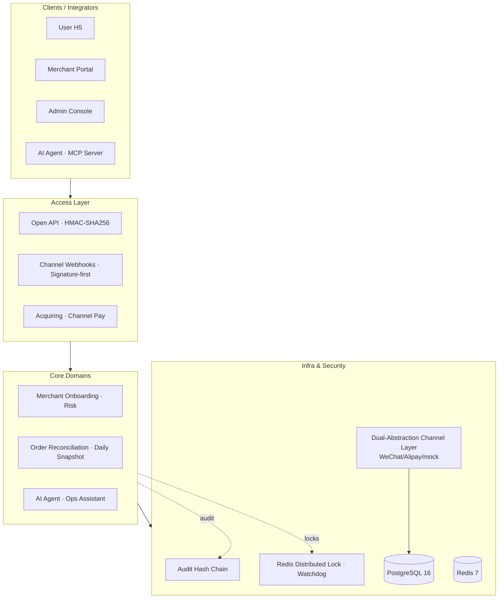

<div align="center">

<p align="center"></p>


# 💳 KeBaiPay

**A compliant aggregated payment technology reference implementation: acquiring, open API, reconciliation, AI agents — funds never touch the platform.**

`NestJS 11` · `TypeScript` · `Prisma 7` · `PostgreSQL 16` · `Redis 7` · `Vue 3` · `MCP`

[](docs/CHANGELOG.md)
[](package.json)
[](LICENSE)
[](https://github.com/x33834/KeBaiPay) · [](https://gitee.com/badhope/KeBaiPay)

[Quick Start](#-quick-start) · [Architecture](#-architecture) · [Acquiring & Reconciliation](#-acquiring--reconciliation) · [Screenshots](#-screenshots) · [Feature Matrix](#-feature-matrix) · [Docs](#-docs) · [Mirrors](#-mirror-repositories)

</div>

<div align="center">

**🌐 Language / 言語：** [简体中文](README.md) · [English](README.en.md) · [日本語](README.ja.md)

</div>

---

## 📖 What is this, exactly?

A **privately deployable reference implementation of a compliant aggregated payment technology service**. Merchant onboarding & KYC + acquiring through licensed channels (WeChat / Alipay) + order-level reconciliation + tamper-evident audit hash chain. **All funds are settled by licensed payment institutions; the platform never holds user funds** — no balance, no top-up, no withdrawal, no transfer, no red packet, no split, no escrow.

Three commands and you have a complete system that can accept payments, reconcile orders, onboard merchants, and let an AI assistant help you operate.

```bash
git clone https://gitcode.com/badhope/KeBaiPay.git && cd KeBaiPay
cp .env.example .env && docker compose -f docker-compose.dev.yml up -d
npm install && npx prisma migrate deploy && npx prisma db seed && npm run start:dev
```

Open <http://localhost:3001>. Test user `13800000001` / `Abc12345` (payer), admin at <http://localhost:3001/admin> with `admin` / `ChangeAdmin2026`.

> Slow pull in China? Mirrored on GitCode / Gitee — see [Mirrors](#-mirror-repositories).

---

## 🏗 Architecture


```mermaid
flowchart TB
    subgraph Client["Clients / Integrators"]
      H5["User H5"]
      Portal["Merchant Portal"]
      Admin["Admin Console"]
      MCP["AI Agent · MCP Server"]
    end
    subgraph Gateway["Access Layer"]
      OpenAPI["Open API · HMAC-SHA256"]
      Webhook["Channel Webhooks · Signature-first"]
      Cashier["Cashier / Payment QR"]
    end
    subgraph Core["Core Domains"]
      Cashier["Acquiring · Channel Pay"]
      Merchant["Merchant Onboarding · Risk"]
      Reconcile["Order Reconciliation · Daily Snapshot"]
      Agent["AI Agent · Ops Assistant"]
    end
    subgraph Infra["Infra & Security"]
      Ledger["Audit Hash Chain"]
      Lock["Redis Distributed Lock · Watchdog"]
      Channel["Dual-Abstraction Channel Layer\nWeChat/Alipay/mock"]
      DB[("PostgreSQL 16")]
      Cache[("Redis 7")]
    end
    Client --> Gateway --> Core --> Infra
    Channel --> DB
    Core -. audit .-> Ledger
    Core -. locks .-> Lock
```

**Four-layer concurrency defense** (an order can never be double-confirmed or double-booked): distributed lock for concurrent entry → DB transaction for intermediate state → conditional atomic `updateMany` for concurrent writes → unique idempotency key for callback retries. Each layer is covered by tests.

---

## 🎯 Who is this for

| You are | What you walk away with |
|---|---|
| **An engineer who wants to understand payment systems** | A complete acquiring reference: Redis lock (watchdog renewal) → transaction → conditional atomic update → idempotency key; tamper-evident audit hash chain; channel-bill-to-order reconciliation |
| **An indie dev who needs to accept money** | WeChat / Alipay / mock connectors, HMAC open API, zero-dependency Node SDK, out-of-the-box cashier and payment QR |
| **A team exploring Agentic Payments** | Built-in MCP server: scope authorization + limits + two-step confirmation + full audit trail |

### Core capabilities

- **Compliant fund flow** — no fund pool on platform: no balance / top-up / withdrawal / transfer / red packet / split / escrow; funds settle via licensed channels; refunds go back the same way; order-level reconciliation cross-checked against daily snapshots
- **Audit hash chain** — every admin action is chained with its predecessor hash; `pg_advisory_xact_lock` prevents forking
- **Key governance** — channel credentials sealed with AES-256-GCM envelope encryption; `appSecret` stored as SHA-256 only; PII masked by field-name whitelist
- **Dual channel abstraction** — PaymentChannel (official SDK) + Connector routing (retry / idempotency gating); adding a new channel is just implementing an interface
- **Commercial-grade open API** — HMAC-SHA256 + time window + nonce replay protection + `timingSafeEqual` + webhook exponential backoff + SSRF hardening
- **Multi-channel reconciliation** — auto pull → match → discrepancy workflow → CSV export
- **AI Agent layer** — Vercel AI SDK, any OpenAI-compatible model; built-in MCP server plus standalone stdio process
- **Observability** — Prometheus `/metrics`, zero-overhead OpenTelemetry, structured logs with traceId

---

## 🔐 Acquiring & Reconciliation (key)

Payment systems fear two things: **wrong books** and **callback abuse**. The following are production-grade and test-covered.

| Defense | How | Effect |
|---|---|---|
| **Dropped-order self-healing** | A scheduled job actively queries the channel for timed-out PENDING orders, sharing the same lock as webhook callbacks | Lost callbacks auto-recover; **amount mismatch or missing amount → fail-closed reject** |
| **Unified pay-password / ID-card validators** | 11 entry points share one `@IsPayPassword` / `@IsIdCard` / `@IsSafeText` decorator | One rule, platform-wide; no bypass |
| **Amount & credential bounds** | DTO `@Min/@Max/@IsNumber({maxDecimalPlaces:2})`; 42 credentials / internal IDs bounded with `@MaxLength` | Reject sub-cent amounts and out-of-bounds params; avoid bcrypt DoS |
| **Webhook signature-first** | Signature verification runs **before** idempotency lookup; forged callbacks return 400 regardless of order state | Replayed forged callbacks to terminal orders no longer slip through |
| **Channel-bill reconciliation** | Scheduled pull of official channel bills → per-order match against platform records → discrepancy workflow → CSV export | One-sided, wrong, or missing orders surface in the discrepancy table; nothing is silently booked |

> One hard rule on the fund path: the amount returned by callback / query must exactly equal the order amount, otherwise it is fail-closed rejected.

> **Production critical config**: `CHANNEL_NOTIFY_URL` (the acquiring channel callback URL) must be set to a publicly reachable `http(s)://` URL; the production security validator rejects localhost or missing values. See [.env.example](.env.example) and [Deployment](docs/DEPLOYMENT.md).

---

## 🖼 Screenshots


<details open>
<summary><b>Admin Console</b></summary>

| Users | Merchants | Payment Orders |
|---|---|---|
|  |  |  |
| Finance | Risk Events | Admin Login |
|  |  |  |

</details>

<details>
<summary><b>User H5</b></summary>

| Login | Bills | AI Assistant |
|---|---|---|
|  |  |  |

</details>

<details>
<summary><b>Merchant Portal</b></summary>

| Dashboard | App Keys | Orders |
|---|---|---|
|  |  |  |
| Payment QR | Reconciliation | Profile |
|  |  |  |

</details>

---

## 💡 Why it's worth a look

Open-source payment projects are usually either an SDK wrapper ("how to call the API") or a payment module bolted onto an e-commerce system ("how to jump to the cashier"). **Few actually explain acquiring, reconciliation, risk, and key governance end-to-end.**

- **Concurrency defense is layered, not one big lock** — lock for entry, conditional atomic update for writes, idempotency key for retries, transaction isolation for intermediate state. Each layer is test-covered.
- **Reconciliation is mandatory** — official channel bills are matched per order; discrepancies enter a workflow. Many systems' "reconciliation" is just a transaction log table with no way to chase mismatches.
- **Audit chain is tamper-evident** — each log carries its predecessor hash; an advisory lock prevents forking. Modify one log and everything after it breaks.
- **AI operations have gates** — MCP tools are not "AI does whatever it wants": scope + per-call/daily limit + two-step confirmation, every call chained.

Honest gaps: **Stripe / UnionPay connectors are skeletons today**; more channels and multi-currency are on the roadmap.

---

## 📊 Feature Matrix

| Capability | Status | Capability | Status |
|---|---|---|---|
| Licensed-channel acquiring (WeChat/Alipay/mock) | ✅ | Multi-channel reconciliation | ✅ |
| Merchant onboarding + KYC | ✅ | Refund to original channel | ✅ |
| Merchant apps + webhook retry | ✅ | Order-level daily snapshot | ✅ |
| Open API + zero-dep Node SDK | ✅ | Coupons / invoices | ✅ |
| WeChat / Alipay official SDK direct | ✅ | Dropped-order auto-heal | ✅ |
| No platform fund pool (compliant) | ✅ | Audit hash chain | ✅ |
| AI Agent + MCP + 2-step confirm | ✅ | Stripe / UnionPay connector | 🚧 skeleton |
| Dual-end KYC UI / channel config center | ✅ | Mini-program SDK / multi-currency | 📋 planned |

---

## 📚 Docs

| Getting started | Deep dive | Ops |
|---|---|---|
| [Quickstart](docs/QUICKSTART.md) | [Developer Guide](docs/DEVELOPER_GUIDE.md) | [Deployment](docs/DEPLOYMENT.md) |
| [API Reference](docs/API_REFERENCE.md) | [Compliance Mode](docs/COMPLIANCE_MODE.md) | [Production Readiness](docs/PRODUCTION_READINESS.md) |
| [SDK Guide](docs/SDK_GUIDE.md) | [Code Health](docs/CODE_HEALTH_REPORT.md) | [Troubleshooting](docs/TROUBLESHOOT.md) |
| [User Manual](docs/USER_MANUAL.md) | [Versioning](docs/VERSIONING.md) | [Changelog](docs/CHANGELOG.md) |
| [User Agreement](docs/legal/user-agreement.md) | [Privacy Policy](docs/legal/privacy-policy.md) | [Merchant Agreement](docs/legal/merchant-agreement.md) |
| [Refund Policy](docs/legal/refund-policy.md) | [Compliance Statement](docs/legal/compliance-statement.md) | [Commercial License](docs/legal/commercial-license.md) |

- Full OpenAPI 3.0 spec (**136 operations / 121 paths**, verified against code): [`docs/openapi.json`](docs/openapi.json)
- 5-step first payment: see [QUICKSTART](docs/QUICKSTART.md)

---

## 🌏 Mirror repositories

Four platforms kept in lockstep (same branches / tags / HEAD). Same content, pick any:

| Platform | URL |
|---|---|
| **GitHub** | [x33834/KeBaiPay](https://github.com/x33834/KeBaiPay) |
| **GitHub** | [Morningstar202604/KeBaiPay](https://github.com/Morningstar202604/KeBaiPay) |
| **GitCode** | [badhope/KeBaiPay](https://gitcode.com/badhope/KeBaiPay) |
| **Gitee** | [badhope/KeBaiPay](https://gitee.com/badhope/KeBaiPay) |

**🌐 Website** (GitHub Pages, two orgs, identical content): <https://x33834.github.io/KeBaiPay/> · <https://morningstar202604.github.io/KeBaiPay/>

---

## 🤝 Contributing

Before a PR: `npm run lint && npx jest --maxWorkers=4` must be green. Releases follow [SemVer](docs/VERSIONING.md); see [CONTRIBUTING.md](CONTRIBUTING.md).

Security issues: use [SECURITY.md](SECURITY.md) private disclosure — do not open a public issue.

---

## ⚠️ Compliance note

The code is MIT, use it freely. **This system is designed as a compliant aggregated payment technology service: the platform itself never holds user funds, and does not offer balance / top-up / withdrawal / transfer / red packet / split / escrow. All fund settlement is performed by licensed payment institutions.** Operating publicly in mainland China still requires the appropriate payment license or a compliant partnership with a licensed institution — that is a business-license matter, not something this code solves. Only the mock channel is enabled by default.

Read [Compliance Mode](docs/COMPLIANCE_MODE.md) and [Production Readiness](docs/PRODUCTION_READINESS.md) before deploying.

---

## 📄 License

[MIT](LICENSE) — free to use, modify, and redistribute, including commercially.

---

<div align="center">

If this project saved you a few late nights, ⭐ Star it — that's the best feedback.

<sub>Built with care by KeBaiPay Contributors · v0.3.5</sub>

</div>
