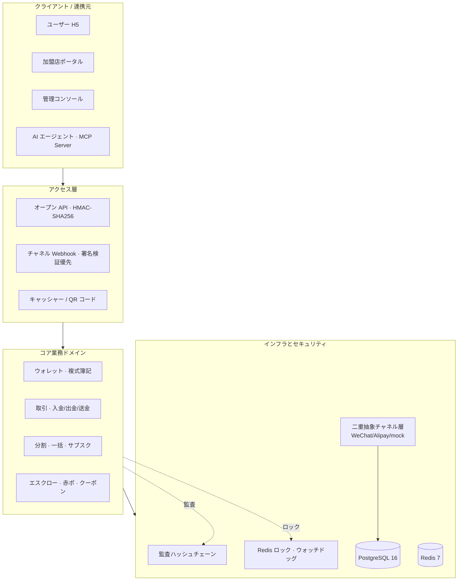
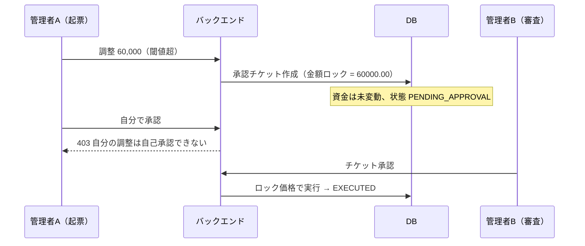

<div align="center">

# 💳 KeBaiPay（科佰ペイ）

**そのまま動く決済ミドルプラットフォーム：ウォレット・収納・オープンAPI・消込・AIエージェント、5層を一気通貫。**

`NestJS 11` · `TypeScript` · `Prisma 7` · `PostgreSQL 16` · `Redis 7` · `Vue 3` · `MCP`

[](docs/CHANGELOG.md)
[](package.json)
[](docs/CHANGELOG.md)
[](docs/CODE_HEALTH_REPORT.md)
[](LICENSE)

[クイックスタート](#-クイックスタート) · [アーキテクチャ](#-アーキテクチャ) · [資金安全設計](#-資金安全設計) · [画面プレビュー](#-画面プレビュー) · [機能マトリクス](#-機能マトリクス) · [ドキュメント](#-ドキュメント) · [ミラーリポジトリ](#-ミラーリポジトリ)

</div>

---

## 📖 これは何か

**プライベートにデプロイできる決済システムの参考実装**。おもちゃのデモではありません——WeChat／Alipay SDK の直接連携、複式簿記、分散ロック、冪等キー、改ざん検知型監査ハッシュチェーンが、本番システムが持っているべき形で揃っています。**OpenAPI エンドポイント 192 個、ビジネスモジュール 41 個、単体テスト 1293 個**。

3 つのコマンドで、ウォレット・収納・消込・そしてあなたのお金を AI が管理する完全なシステムが手に入ります。

```bash
git clone https://gitcode.com/badhope/KeBaiPay.git && cd KeBaiPay
cp .env.example .env && docker compose -f docker-compose.dev.yml up -d
npm install && npx prisma migrate deploy && npx prisma db seed && npm run start:dev
```

<http://localhost:3001> を開きます。テストアカウント `13800000001` / `Abc12345`（残高 10,000 元、決済パスワード `123456`）；管理画面 <http://localhost:3001/admin> は `admin` / `ChangeAdmin2026`。

> 取得が遅い場合は GitCode／Gitee ミラーがあります——[ミラーリポジトリ](#-ミラーリポジトリ)参照。

---

## 🏗 アーキテクチャ



**4 層の同時実行防御**（同じお金が二重に引かれたり二重に入金されたりしない）：分散ロックが同時進入を防ぐ → DB トランザクションが途中状態を扱う → 条件付き原子更新 `updateMany` が同時書込を扱う → 冪等キーの一意制約が再試行を扱う。各層の変更はテストでカバーされています。

---

## 🎯 何ができるか

| あなたの立場 | 得られるもの |
|---|---|
| **決済システムを理解したいエンジニア** | 完全な資金フローの手本：Redis 分散ロック（ウォッチドッグ更新）→ トランザクション → 条件付き原子更新 → 冪等キー という 4 層防御；貸借強制均衡の複式簿記；改ざん検知型監査ハッシュチェーン |
| **回収機能が必要な個人開発者** | WeChat/Alipay/mock コネクタ、HMAC オープン API、依存ゼロの Node SDK、すぐ使えるキャッシャーと回収 QR |
| **Agentic Payments を探るチーム** | 組込み MCP Server で Claude／Cursor が安全に資金操作：scope 認可 ＋ 上限 ＋ 確認 ＋ 全件監査 |

### コア機能

- **資金安全設計** — 引出の二相コミット ＋ タイムアウト走査消込で、プロセスクラッシュでも二重払いしない；分割の累積超過検証、一括送金のクラッシュ復旧、すべての境界ケースをテスト
- **複式簿記 ＋ 監査ハッシュチェーン** — 貸借が不均衡なら即ロールバック；管理操作は全件チェーン化、`pg_advisory_xact_lock` で分岐を防止
- **鍵ガバナンス** — チャネル認証情報は AES-256-GCM エンベロープ暗号で保存；`appSecret` は SHA-256 のみ保存；機微項目はフィールド名許可リストでマスク
- **二重抽象チャネル層** — PaymentChannel（公式 SDK）＋ Connector ルーティング（リトライ／冪等ゲート）；新チャネルはインタフェース実装のみ
- **商用ゲートウェイ並みのオープン API** — HMAC-SHA256 ＋ 時間窓 ＋ nonce リプレイ防止 ＋ `timingSafeEqual` ＋ Webhook 指数バックオフ ＋ SSRF 対策
- **マルチチャネル消込集約** — 自動取得 → 照合 → 差異ワークフロー → CSV 出力
- **AI エージェント層** — Vercel AI SDK で任意の OpenAI 互換モデル；MCP Server は in-process と独立 stdio の両形態
- **可観測性** — Prometheus `/metrics`、オーバーヘッドゼロの OpenTelemetry、traceId 全件構造ログ

---

## 🔐 資金安全設計（注目）

決済システムが最も恐れるのは二つ：**お金の計算違い** と **インタフェースの突破**。以下の機能は実装されテストもあり、本プロジェクトの核となる売りです。

| 防御 | 手法 | 効果 |
|---|---|---|
| **大口調整の二人承認** | 管理者の単発調整で `\|amount\| ≥ LARGE_ADJUSTMENT_THRESHOLD_YUAN`（既定 5 万円）の場合、直接動かさず承認チケットを作成；別の管理者が承認してから**ロック価格**で実行 | 一人では大口を勝手に動かせない；本人承認は **403**；楽観ロック占有で同時二重実行を防止 |
| **欠単の自己修復（PENDING 自動消込）** | スケジュールジョブがタイムアウト入金注文に対してチャネル `queryRecharge` を能動照会、コールバックと同一分散ロックを共有 | コールバック喪失でも自動入金；**金額不一致／欠損は一律却下（fail-closed）** |
| **決済パスワード／身分証の統一検証** | 11 の入口が同じ `@IsPayPassword` / `@IsIdCard` / `@IsSafeText` デコレータを再利用 | ルールは一つ、プラットフォーム全体で一致、迂回なし |
| **調整境界 ＋ 認証情報長** | DTO に `@Min(-500000)@Max(500000)@IsNumber({maxDecimalPlaces:2})`；42 項目の認証／内部 ID に `@MaxLength` | サブ銭単位と範囲外調整を拒否；bcrypt 入力境界 DoS を回避 |
| **Webhook 署名検証優先** | 署名検証を冪等チェック**より前**に実行；偽造コールバックは注文状態に関わらず 400 | 終端注文への偽造リプレイが冪等キャッシュを通過しなくなる |



> 資金パスには**迂回不可能な鉄則**もあります：コールバック／照会で返る金額は注文金額と完全に一致しなければならず、そうでなければ fail-closed で却下——片側や不一致の簿記は静かに記帳されません。

---

## 🖼 画面プレビュー


<details open>
<summary><b>管理コンソール（10 ページ）</b></summary>

| 概要 | ユーザー | 加盟店 |
|---|---|---|
|  |  |  |
| 実名審査 | 出金審査 | 注文 |
|  |  |  |
| 財務 | リスク | エージェント |
|  |  |  |

</details>

<details>
<summary><b>ユーザー H5（7 ページ）</b></summary>

| ウォレット | 入金 | 赤ポ |
|---|---|---|
|  |  |  |
| 明細 | キャッシャー | AI アシスタント |
|  |  |  |

</details>

<details>
<summary><b>加盟店ポータル（8 ページ）</b></summary>

| ダッシュボード | アプリ鍵 | 注文 |
|---|---|---|
|  |  |  |
| QR コード | 消込照会 | 加盟店情報 |
|  |  |  |

</details>

---

## 💡 見る価値がある理由

オープンソースの決済プロジェクトの多くは、SDK ラッパー（「API の呼び方」だけ）か、EC システムの決済モジュール（「キャッシャーへの飛び方」だけ）のどちらかです。**帳簿・消込・リスク・鍵ガバナンスを本当に説明しているものは少ない**。

このプロジェクトで参考になるかもしれない点：

- **同時実行防御は層になっている、一つの鍵ですべてを解決するのではない** — ロックは同時進入を、条件付き原子更新は同時書込を、冪等キーは再試行を、トランザクション分離は途中状態を解決。各層は異なる問題を解き、いずれかを変えてもテストが守る。
- **複式簿記は強制** — 不均衡なら即ロールバック。多くのシステムの「帳簿」は単なる流水中、合わなくても調べようがない。
- **監査チェーンは改ざん検知型** — 各ログは直前のハッシュを持ち、DB アドバイザリロックで分岐を防止。一つを改ざんすると後続がすべて切れる。
- **AI の支出にはゲートがある** — MCP ツールは「AI が何でもする」のではなく、scope 認可 ＋ 単発／日次上限 ＋ 資金操作の確認、すべての呼出が監査チェーンに載る。

未完成も隠しません：**Stripe／銀聯 Connector は骨格のみ**、カバレッジは 55.6%（v0.3.1 から実測ベースラインを jest ゲートにして退行を防止、1 年以内に 75% へ——詳細は[コードヘルスレポート](docs/CODE_HEALTH_REPORT.md)）。この二つが次の重点です。

---

## 📊 機能マトリクス

| 領域 | 状態 | 領域 | 状態 |
|---|---|---|---|
| ウォレット 入金/送金/出金/明細 | ✅ | マルチチャネル消込 | ✅ |
| 赤ポ（ランダム/通常/専用/合言葉） | ✅ | エスクロー | ✅ |
| 加盟店登録/アプリ/Webhook リトライ | ✅ | 一括送金 ＋ クラッシュ復旧 | ✅ |
| オープン API ＋ 依存ゼロ Node SDK | ✅ | サブスク／分割 | ✅ |
| WeChat/Alipay 公式 SDK | ✅ | クーポン／紹介還元／請求書 | ✅ |
| 大口調整の二人承認 | ✅ | 入金欠単の自動消込 | ✅ |
| AI エージェント ＋ MCP ＋ 確認 | ✅ | Stripe／銀聯 Connector | 🚧 骨格 |
| KYC 両端 UI／チャネル設定センター | ✅ | ミニプログラム SDK／多通貨 | 📋 計画中 |

---

## 📚 ドキュメント

| 入門 | 深掘り | 運用 |
|---|---|---|
| [クイックスタート](docs/QUICKSTART.md) | [開発者ガイド](docs/DEVELOPER_GUIDE.md) | [本番デプロイ](docs/DEPLOYMENT.md) |
| [API リファレンス](docs/API_REFERENCE.md) | [専門家評価とロードマップ](docs/EXPERT_PANEL_ASSESSMENT.md) | [本番準備チェックリスト](docs/PRODUCTION_READINESS.md) |
| [SDK ガイド](docs/SDK_GUIDE.md) | [コードヘルスレポート](docs/CODE_HEALTH_REPORT.md) | [トラブルシュート](docs/TROUBLESHOOT.md) |
| [ユーザーマニュアル](docs/USER_MANUAL.md) | [バージョニング](docs/VERSIONING.md) | [変更履歴](docs/CHANGELOG.md) |
| [利用規約](docs/legal/user-agreement.md) | [プライバシーポリシー](docs/legal/privacy-policy.md) | [加盟店規約](docs/legal/merchant-agreement.md) |
| [返金・紛争ルール](docs/legal/refund-policy.md) | [コンプライアンス声明](docs/legal/compliance-statement.md) | [商用ライセンス](docs/legal/commercial-license.md) |

- 完全な OpenAPI 3.0 仕様（192 エンドポイント）：[`docs/openapi.json`](docs/openapi.json)
- 加盟店の 5 ステップ初回回収： [QUICKSTART](docs/QUICKSTART.md) 参照

---

## 🌏 ミラーリポジトリ

4 プラットフォームで並列同期保守（ブランチ・タグ・HEAD 完全一致）——どれを選んでも同じ、えこひいきなし：

| プラットフォーム | URL |
|---|---|
| **GitHub** | [x33834/KeBaiPay](https://github.com/x33834/KeBaiPay) |
| **GitHub** | [Morningstar202604/KeBaiPay](https://github.com/Morningstar202604/KeBaiPay) |
| **GitCode** | [badhope/KeBaiPay](https://gitcode.com/badhope/KeBaiPay) |
| **Gitee** | [badhope/KeBaiPay](https://gitee.com/badhope/KeBaiPay) |

**🌐 公式サイト**（GitHub Pages 両アカウント展開）： <https://x33834.github.io/KeBaiPay/> · <https://morningstar202604.github.io/KeBaiPay/>

---

## 🤝 コントリビュート

PR を開く前に `npm run lint && npx jest --maxWorkers=4` が緑になることを確認してください。リリースは [SemVer 規律](docs/VERSIONING.md) に従います；[CONTRIBUTING.md](CONTRIBUTING.md) 参照。

セキュリティ脆弱性は公開 Issue ではなく [SECURITY.md](SECURITY.md) 経由で非公開に報告してください。

---

## ⚠️ コンプライアンスについて

コードは MIT——自由に使えます。ただし**本システムはプラットフォーム内帳簿を含み、中国本土で実運用すると無資格決済事業および「二清（違法資金プール）」の紅線に抵触**します——それはライセンスで解決できる資格の問題です。既定では mock チャネルのみ有効で、違法営業はそもそも動きません。

本番前に[コンプライアンス分析](docs/EXPERT_PANEL_ASSESSMENT.md) と[本番チェックリスト](docs/PRODUCTION_READINESS.md) をお読みください。

---

## 📄 ライセンス

[MIT](LICENSE) — 商用含め、自由に利用・改変・再配布可能。

---

<div align="center">

このプロジェクトが何夜も救ったり、ある資金フローがやっと分かったりしたら、**Star ⭐ が最高のフィードバック**です。

必要な人にシェアしてください；良いものは見られてこそ保守され続けます。

<sub>Built with care by KeBaiPay Contributors · v0.3.2</sub>

</div>
