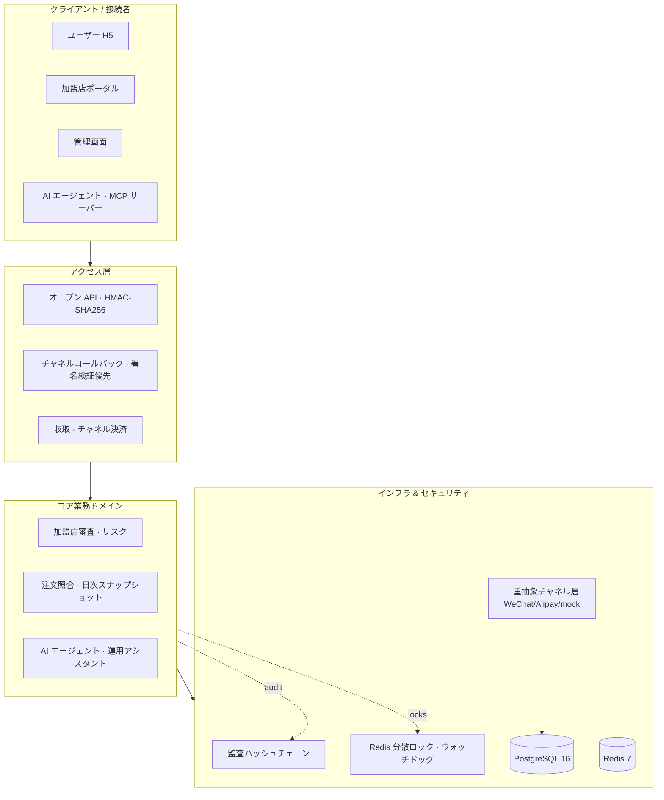

<div align="center">

<p align="center"></p>


# 💳 KeBaiPay（科佰収単）

**コンプライアンス準拠の統合決済技術リファレンス実装：収取・オープン API・照合・AI エージェント。資金は一切プラットフォームを経由しない。**

`NestJS 11` · `TypeScript` · `Prisma 7` · `PostgreSQL 16` · `Redis 7` · `Vue 3` · `MCP`

[](docs/CHANGELOG.md)
[](package.json)
[](LICENSE)
[](https://github.com/x33834/KeBaiPay) · [](https://gitee.com/badhope/KeBaiPay)

[クイックスタート](#-クイックスタート) · [システム構成](#-システム構成) · [決済と照合](#-決済と照合) · [スクリーンショット](#-スクリーンショット) · [機能マトリクス](#-機能マトリクス) · [ドキュメント](#-ドキュメント) · [ミラー](#-ミラーリポジトリ)

</div>

<div align="center">

**🌐 Language / 言語：** [简体中文](README.md) · [English](README.en.md) · [日本語](README.ja.md)

</div>

---

## 📖 これは何か

**プライベートデプロイ可能な、コンプライアンス準拠の統合決済技術サービスのリファレンス実装**です。加盟店審査・実名認証 + ライセンスチャネル（WeChat / Alipay）経由の収取 + 注文単位の照合 + 改ざん検知監査ハッシュチェーンを備えます。**資金はすべてライセンス支付機関が清算し、プラットフォームは一切ユーザー資金を保有しません** — 残高・チャージ・出金・送金・赤ポ・分割・エスクローは一切ありません。

3 つのコマンドで、決済・照合・加盟店管理・AI 運用アシスタントまで揃ったシステムが立ち上がります。

```bash
git clone https://gitcode.com/badhope/KeBaiPay.git && cd KeBaiPay
cp .env.example .env && docker compose -f docker-compose.dev.yml up -d
npm install && npx prisma migrate deploy && npx prisma db seed && npm run start:dev
```

<http://localhost:3001> を開きます。テストユーザー `13800000001` / `Abc12345`（支払側）、管理画面 <http://localhost:3001/admin> は `admin` / `ChangeAdmin2026`。

> 中国国内の clone が遅い？GitCode / Gitee にミラーがあります → [ミラー](#-ミラーリポジトリ)。

---

## 🏗 システム構成


```mermaid
flowchart TB
    subgraph Client["クライアント / 接続者"]
      H5["ユーザー H5"]
      Portal["加盟店ポータル"]
      Admin["管理画面"]
      MCP["AI エージェント · MCP サーバー"]
    end
    subgraph Gateway["アクセス層"]
      OpenAPI["オープン API · HMAC-SHA256"]
      Webhook["チャネルコールバック · 署名検証優先"]
      Cashier["キャッシャー / 収取 QR"]
    end
    subgraph Core["コア業務ドメイン"]
      Cashier["収取 · チャネル決済"]
      Merchant["加盟店審査 · リスク"]
      Reconcile["注文照合 · 日次スナップショット"]
      Agent["AI エージェント · 運用アシスタント"]
    end
    subgraph Infra["インフラ & セキュリティ"]
      Ledger["監査ハッシュチェーン"]
      Lock["Redis 分散ロック · ウォッチドッグ"]
      Channel["二重抽象チャネル層\nWeChat/Alipay/mock"]
      DB[("PostgreSQL 16")]
      Cache[("Redis 7")]
    end
    Client --> Gateway --> Core --> Infra
    Channel --> DB
    Core -. audit .-> Ledger
    Core -. locks .-> Lock
```

**4 層の並行防御**（同一注文が二重に確定・計上されない）：分散ロックで並行アクセスを制御 → DB トランザクションで中間状態を保護 → 条件付き原子更新 `updateMany` で並行書き込みを制御 → べき等キーのユニーク制約でコールバック再送に対応。各層はテストで担保。

---

## 🎯 対象ユーザー

| あなたは | 持ち帰れるもの |
|---|---|
| **決済システムを理解したいエンジニア** | 収取リファレンス一式：Redis 分散ロック（ウォッチドッグ更新）→ トランザクション → 条件付き原子更新 → べき等キー、改ざん検知監査ハッシュチェーン、チャネル取引明細と注文の照合 |
| **個人開発で決済が必要な人** | WeChat / Alipay / mock チャネルコネクタ、HMAC オープン API、ゼロ依存 Node SDK、そのまま使えるキャッシャーと収取 QR |
| **Agentic Payments を試すチーム** | 内蔵 MCP サーバー：スコープ認可 + 上限 + 二段階確認 + 全監査トレイル |

### コア機能

- **コンプライアンス資金フロー** — プラットフォームに資金プールなし：残高・チャージ・出金・送金・赤ポ・分割・エスクローなし。資金はライセンスチャネルが直接清算。返金は元の経路へ。注文単位の照合と日次スナップショットで相互クロスチェック
- **監査ハッシュチェーン** — 管理操作は全てチェーン化。前レコードのハッシュを持ち、`pg_advisory_xact_lock` で分岐を防止
- **鍵管理** — チャネル認証情報は AES-256-GCM 封筒暗号で保存、`appSecret` は SHA-256 のみ保持、PII はフィールド名ホワイトリストでマスク
- **二重抽象チャネル層** — PaymentChannel（公式 SDK）+ Connector ルーティング（リトライ・べき等ゲート）。新チャネルは I/F 実装だけで追加可能
- **商用ゲートウェイ並みのオープン API** — HMAC-SHA256 + 時間窓 + nonce リプレイ防止 + `timingSafeEqual` + Webhook 指数バックオフ + SSRF 堅牢化
- **マルチチャネル照合** — 自動取得 → 突合 → 差異ワークフロー → CSV エクスポート
- **AI エージェント層** — Vercel AI SDK、OpenAI 互換モデルに対応。内蔵 MCP サーバーと独立 stdio プロセスの二形態
- **可観測性** — Prometheus `/metrics`、ゼロオーバーヘッド OpenTelemetry、traceId 構造化ログ

---

## 🔐 決済と照合（要点）

決済システムで一番怖いのは**帳簿の誤り**と**コールバックの不正利用**。以下は全て本番品質でテスト付き。

| 防御 | 実装 | 効果 |
|---|---|---|
| **ドロップオーダー自己回復** | 定期ジョブがタイムアウトした PENDING 注文を能動的にチャネルへ問い合わせ、コールバックと同一ロックを共有 | コールバック喪失も自動確定。**金額不一致/不足は fail-closed で拒否** |
| **支払パスワード/身分証の統一バリデータ** | 11 の入口が共通の `@IsPayPassword` / `@IsIdCard` / `@IsSafeText` デコレータを使用 | 一箇所のルールが全体に適用され、迂回を防止 |
| **金額/認証情報の境界** | DTO で `@Min/@Max/@IsNumber({maxDecimalPlaces:2})`、42 箇所の認証情報/内部 ID に `@MaxLength` | サブセント金額と範囲外パラメータを拒否、bcrypt DoS を回避 |
| **Webhook 署名検証優先** | 署名検証をべき等チェック**より前**で実行。偽造コールバックは注文状態によらず 400 | 確定済み注文への偽造リプレイがべき等キャッシュをすり抜けない |
| **チャネル取引明細照合** | 定期取得した公式取引明細をプラットフォーム注文と 1 件ずつ突合 → 差異ワークフロー → CSV エクスポート | 片手・誤り・漏れは全て差異テーブルに露出。黙って計上されない |

> 資金パス上の**絶対ルール**：コールバック/問合せの金額は注文金額と完全一致が必須。不一致は fail-closed で確定拒否。

> **本番環境の重要設定**：`CHANNEL_NOTIFY_URL`（収取チャネルコールバック URL）は、外部から到達可能な完全な `http(s)://` URL を設定すること。本番セキュリティバリデータが localhost や未設定を拒否します。詳細は [.env.example](.env.example) と [デプロイ](docs/DEPLOYMENT.md) を参照。

---

## 🖼 スクリーンショット


<details open>
<summary><b>管理画面</b></summary>

| ユーザー | 加盟店 | 決済注文 |
|---|---|---|
|  |  |  |
| 財務 | リスクイベント | 管理ログイン |
|  |  |  |

</details>

<details>
<summary><b>ユーザー H5</b></summary>

| ログイン | 請求書 | AI アシスタント |
|---|---|---|
|  |  |  |

</details>

<details>
<summary><b>加盟店ポータル</b></summary>

| ダッシュボード | アプリキー | 注文管理 |
|---|---|---|
|  |  |  |
| 収取 QR | 照合 | 加盟店情報 |
|  |  |  |

</details>

---

## 💡 注目ポイント

決済関連のオープンソースは、SDK ラッパー（「API の呼び方」だけ）か、EC システムの決済モジュール（「キャッシャーへのジャンプ」だけ）のどちらかが大半です。**収取・照合・リスク・鍵管理を最後まで説明しているものは稀です。**

- **並行防御は多層** — ロック、条件付き原子更新、べき等キー、トランザクション分離がそれぞれ別の問題を解決
- **照合は義務** — 公式チャネルの取引明細と注文を 1 件ずつ突合。多くのシステムの「照合」は単なる取引履歴テーブルで、差異を追えない
- **監査チェーンは改ざん検知** — 1 行でも改変すると後続が全て切れる
- **AI 操作には門** — スコープ + 上限 + 二段階確認、全て監査チェーンに記録

正直なギャップ：**Stripe / 銀聯コネクタは現在スケルトン**。マルチチャネル・マルチカレンシーはロードマップ上。

---

## 📊 機能マトリクス

| 機能域 | 状態 | 機能域 | 状態 |
|---|---|---|---|
| ライセンスチャネル収取（WeChat/Alipay/mock） | ✅ | マルチチャネル照合 | ✅ |
| 加盟店審査 + 実名認証 | ✅ | 元経路返金 | ✅ |
| 加盟店アプリ/Webhook リトライ | ✅ | 注文単位日次スナップショット | ✅ |
| オープン API + ゼロ依存 Node SDK | ✅ | クーポン / インボイス | ✅ |
| WeChat / Alipay 公式 SDK 直結 | ✅ | ドロップオーダー自己回復 | ✅ |
| プラットフォーム資金プールなし（コンプラ） | ✅ | 監査ハッシュチェーン | ✅ |
| AI エージェント + MCP + 二段階確認 | ✅ | Stripe / 銀聯コネクタ | 🚧 スケルトン |
| 両端 KYC UI / チャネル設定センター | ✅ | ミニアプリ SDK / マルチカレンシー | 📋 計画中 |

---

## 📚 ドキュメント

| 入門 | 深掘り | 運用 |
|---|---|---|
| [クイックスタート](docs/QUICKSTART.md) | [開発ガイド](docs/DEVELOPER_GUIDE.md) | [デプロイ](docs/DEPLOYMENT.md) |
| [API リファレンス](docs/API_REFERENCE.md) | [コンプライアンスモード](docs/COMPLIANCE_MODE.md) | [本番準備](docs/PRODUCTION_READINESS.md) |
| [SDK ガイド](docs/SDK_GUIDE.md) | [コード健全性](docs/CODE_HEALTH_REPORT.md) | [トラブルシュート](docs/TROUBLESHOOT.md) |
| [ユーザーマニュアル](docs/USER_MANUAL.md) | [バージョニング](docs/VERSIONING.md) | [更新履歴](docs/CHANGELOG.md) |
| [利用規約](docs/legal/user-agreement.md) | [プライバシーポリシー](docs/legal/privacy-policy.md) | [加盟店規約](docs/legal/merchant-agreement.md) |
| [返金ポリシー](docs/legal/refund-policy.md) | [コンプライアンス声明](docs/legal/compliance-statement.md) | [商用ライセンス](docs/legal/commercial-license.md) |

- OpenAPI 3.0 完全仕様（**136 オペレーション / 121 パス**、コード実測値と一致）：[`docs/openapi.json`](docs/openapi.json)
- 加盟店 5 ステップで初回決済：[QUICKSTART](docs/QUICKSTART.md)

---

## 🌏 ミラーリポジトリ

4 プラットフォーム同期維持（ブランチ/タグ/HEAD 完全一致）。内容は同じ、好きなものを：

| プラットフォーム | URL |
|---|---|
| **GitHub** | [x33834/KeBaiPay](https://github.com/x33834/KeBaiPay) |
| **GitHub** | [Morningstar202604/KeBaiPay](https://github.com/Morningstar202604/KeBaiPay) |
| **GitCode** | [badhope/KeBaiPay](https://gitcode.com/badhope/KeBaiPay) |
| **Gitee** | [badhope/KeBaiPay](https://gitee.com/badhope/KeBaiPay) |

**🌐 Web サイト**（GitHub Pages、2 組織で同一内容）：<https://x33834.github.io/KeBaiPay/> · <https://morningstar202604.github.io/KeBaiPay/>

---

## 🤝 コントリビュート

PR 前に `npm run lint && npx jest --maxWorkers=4` がグリーンであること。リリースは [SemVer](docs/VERSIONING.md) に従います。詳細は [CONTRIBUTING.md](CONTRIBUTING.md)。

セキュリティの脆弱性は [SECURITY.md](SECURITY.md) の非公開開示チャネルを使ってください。公開 issue は禁止。

---

## ⚠️ コンプライアンスについて

コードは MIT で自由に使えます。**本システムは「コンプライアンス準拠の統合決済技術サービス」として設計されており、プラットフォーム自体はユーザー資金を一切保有せず、残高・チャージ・出金・送金・赤ポ・分割・エスクローを提供しません。すべての資金清算はライセンス支付機関が行います。** ただし中国本土で対外営業するには、相応の支付業務ライセンス、またはライセンス機関とのコンプライアンス提携が必要です。これは営業資格の問題であり、コードで解決できるものではありません。デフォルトでは mock チャネルのみ有効です。

デプロイ前に [コンプライアンスモード](docs/COMPLIANCE_MODE.md) と [本番準備](docs/PRODUCTION_READINESS.md) を必ずお読みください。

---

## 📄 ライセンス

[MIT](LICENSE) — 商用利用を含め、自由に使用・改変・再配布できます。

---

<div align="center">

もしこのプロジェクトがあなたの徹夜を数時間でも減らしたなら、⭐ Star をください — それが一番のフィードバックです。

<sub>Built with care by KeBaiPay Contributors · v0.3.5</sub>

</div>
