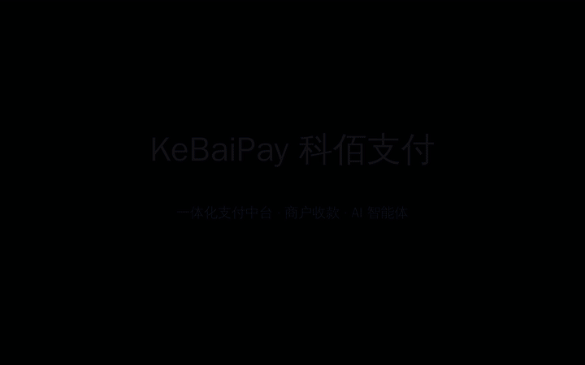
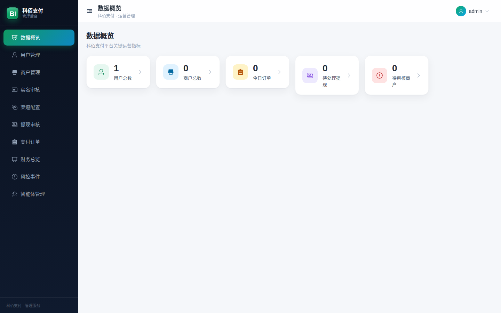
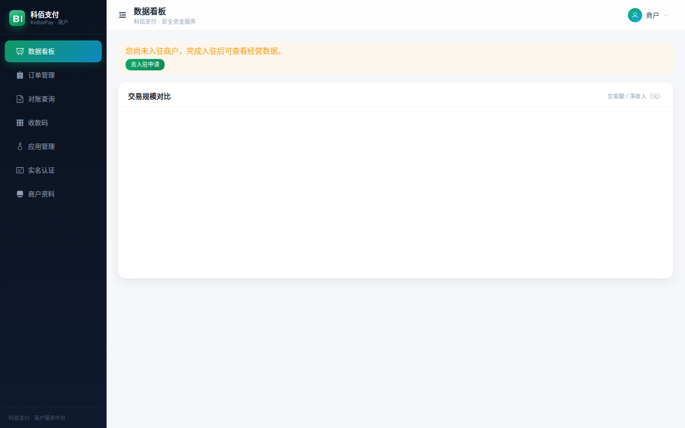
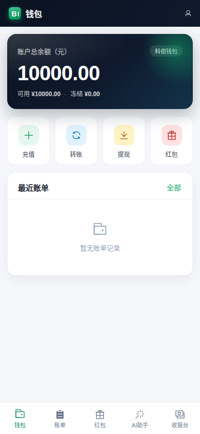

<div align="center">

# 💳 KeBaiPay 科佰支付

**自托管的开源支付中台 · Self-hosted Open-Source Payment Platform**

个人钱包 + 商户收款 + 开放 API + 多渠道对账聚合 + AI 智能体，一体化开箱即用

`NestJS 11` `TypeScript 6` `Prisma 7` `PostgreSQL 16` `Redis 7` `Vercel AI SDK` `MCP`

[](https://github.com/Morningstar202604/KeBaiPay/actions/workflows/ci.yml)
[](docs/CHANGELOG.md)
[](package.json)
[](docs/CHANGELOG.md)
[](LICENSE)
[](https://github.com/Morningstar202604/KeBaiPay)

[快速开始](#-快速开始) · [功能矩阵](#-功能矩阵) · [界面预览](#-界面预览) · [文档](#-文档索引) · [路线图](docs/EXPERT_PANEL_ASSESSMENT.md)

</div>

---

## 📖 项目简介

KeBaiPay 是一套**可私有化部署**的支付中台参考实现：把「C 端钱包、B 端商户收单、开放 API 网关、
多平台对账、AI 智能体操作层」五层能力收敛到一个 NestJS 单体内核中。

它最适合三类读者：

| 你是谁 | 你能得到什么 |
|---|---|
| 🔍 **学习支付系统的工程师** | 工业级资金链路范本：分布式锁 + 条件原子更新 + 幂等键唯一约束四层并发防御、复式记账、防篡改审计哈希链 |
| 🛠 **需要收款能力的独立开发者** | 微信/支付宝/mock 四渠道连接器、HMAC 开放 API、Node SDK 拷贝即用、收银台开箱可用 |
| 🤖 **探索 Agentic Payments 的团队** | MCP Server 让 Claude/Cursor 等 AI 安全管钱：scope 授权 + 限额 + 资金二次确认 + 审计链 |

> ⚠️ **许可与合规**：本项目采用 [PolyForm Noncommercial 1.0.0](LICENSE)，仅限学习研究等非商业用途，
> 商用需另行商业授权。系统含平台内钱包账本，在中国大陆直接运营涉及无证支付业务红线——
> 生产部署前请阅读 [合规分析](docs/EXPERT_PANEL_ASSESSMENT.md)。默认仅提供 mock 渠道，想违规营业都起不来。

## 核心亮点

- 🏦 **资金安全工程** — Redis 分布式锁（看门狗续期）→ `$transaction` → 条件原子更新 → 幂等键唯一约束，四层防线；提现两阶段设计 + 超时扫描核对，崩溃不双得
- 🧾 **复式记账 + 审计哈希链** — 借贷强制平衡否则回滚；管理操作全量入链，`pg_advisory_xact_lock` 防分叉
- 🔐 **密钥治理** — 渠道凭据 AES-256-GCM 信封加密落库、appSecret 只存 SHA-256、敏感字段脱敏展示
- 🌉 **双抽象渠道层** — PaymentChannel（微信官方 SDK / 支付宝官方 SDK / mock）+ Connector 路由（重试幂等门控），新增渠道成本中低
- 🚪 **开放 API 对标商用网关** — HMAC-SHA256（先 sha256 后签名）+ 时间窗 + nonce 防重放 + timingSafeEqual + Webhook 指数退避 + SSRF 加固
- 📊 **多渠道对账聚合（S5）** — 自动拉单 → 匹配 → 差异工作流 → CSV 导出
- 🤖 **AI Agent 层（差异化）** — Vercel AI SDK 接任意 OpenAI 兼容 LLM；内置 MCP Server 与独立 stdio 进程两种形态
- 🔭 **可观测性** — Prometheus `/metrics`、OpenTelemetry 零开销接入、结构化日志 traceId 全链路

## 🚀 快速开始

```bash
git clone https://github.com/Morningstar202604/KeBaiPay.git && cd KeBaiPay
npm install

cp .env.example .env                          # 开发模式默认 mock 渠道/短信
docker compose -f docker-compose.dev.yml up -d # PostgreSQL 16 + Redis 7

npx prisma migrate deploy && npx prisma db seed
npm run start:dev                              # http://localhost:3001
```

**测试账号**（seed 预置）：用户 `13800000001` / `Abc12345`（支付密码 `123456`）· 管理员 `admin` / `Admin2026`

<details>
<summary><b>前端三端构建（可选）</b></summary>

```bash
cd web        && npm i && npm run build   # 商户后台 → /portal
cd web-h5     && npm i && npm run build   # 用户 H5   → /h5
cd web-admin  && npm i && npm run build   # 管理后台 → /admin
```
构建产物存在时由后端自动托管。
</details>

<details>
<summary><b>商户 5 步接入第一笔收款</b></summary>

```js
// 1-3. 注册账号 → 实名认证 → 商户入驻（管理员审核）
// 4. 商户后台创建应用，拿 appId / appSecret（仅显示一次）
// 5. 服务端拷贝零依赖 SDK：
const { KeBaiPay } = require('./public/sdk/kebaipay.js')
const kb = new KeBaiPay({ appId: '...', appSecret: process.env.KB_SECRET, baseUrl: 'https://your-domain' })
const order = await kb.createOrder({ merchantOrderNo: 'MO_001', amount: 9.9, subject: '会员月卡' })
// order.cashierUrl → 用户跳转完成支付，Webhook 回调通知你的服务端
```
完整流程见 [QUICKSTART](docs/QUICKSTART.md) · [API_REFERENCE](docs/API_REFERENCE.md) · [SDK_GUIDE](docs/SDK_GUIDE.md)
</details>

## 🖼 界面预览



| 管理后台 | 商户门户 | 用户 H5 |
|---|---|---|
|  |  |  |
| 提现审核 / 风控事件 / Agent 管理 | 订单对账 / 收款码 / 应用密钥 | 钱包 / 红包 / AI 助手 |

更多截图见 [`demo/screenshots/`](demo/screenshots)（24 张），演示视频见 [`demo/videos/`](demo/videos)。

## 📊 功能矩阵

| 能力域 | 状态 | 能力域 | 状态 |
|---|---|---|---|
| 钱包 充值/转账/提现/账单 | ✅ | 多渠道对账聚合 S5 | ✅ |
| 红包（拼手气/普通/专属/口令） | ✅ | 担保交易 Escrow（API） | ✅ |
| 商户入驻/应用/Webhook 重试 | ✅ | 批量转账 + 崩溃恢复（API） | ✅ |
| 开放 API + Node SDK | ✅ | 订阅计费 / 分账（API） | ✅ |
| 微信/支付宝官方 SDK 直连 | ✅ | 优惠券 / 邀请返现 / 发票（API） | ✅ |
| Stripe/银联 Connector | 🚧 骨架 | KYC 双端 UI / 渠道配置中心 | 🚧 Phase 1 |
| AI Agent + MCP + 二次确认 | ✅ | 小程序 SDK / 多币种 | 📋 Phase 2-3 |

## 📚 文档索引

| 文档 | 说明 | 文档 | 说明 |
|---|---|---|---|
| [QUICKSTART](docs/QUICKSTART.md) | 最短收款路径 | [DEPLOYMENT](docs/DEPLOYMENT.md) | 生产部署 |
| [API_REFERENCE](docs/API_REFERENCE.md) | API + 错误码 KBxxx | [PRODUCTION_READINESS](docs/PRODUCTION_READINESS.md) | 上线清单与红线 |
| [SDK_GUIDE](docs/SDK_GUIDE.md) | Node/Py/Java/PHP 示例 | [DEVELOPER_GUIDE](docs/DEVELOPER_GUIDE.md) | 架构与规范 |
| [VERSIONING](docs/VERSIONING.md) | SemVer 发版纪律 | [EXPERT_PANEL_ASSESSMENT](docs/EXPERT_PANEL_ASSESSMENT.md) | 专家评审与路线图 |
| [LAUNCH](docs/LAUNCH.md) | 开源发布准备清单 | [CHANGELOG](docs/CHANGELOG.md) | 版本更新记录 |

## 🗺 路线图

```
v0.2.1 ✅ 可信度（安全修复+版本纪律） → v0.3 可用性（三大UI断点+一键体验）
→ v0.4 影响力（AI Agent 打通真实划转+小程序SDK） → v0.5 商业化（多币种+生态）
```

详见 [专家评审报告与竞争力路线图](docs/EXPERT_PANEL_ASSESSMENT.md)。

## 🤝 参与贡献

PR 前 `npm run lint && npm test` 必须全绿；发版遵循 [SemVer 纪律](docs/VERSIONING.md)。
安全问题请走 [SECURITY.md](SECURITY.md) 私下披露，勿公开 issue。

## ⭐ 仓库

| 平台 | 仓库 |
|---|---|
| GitHub | [Morningstar202604/KeBaiPay](https://github.com/Morningstar202604/KeBaiPay) |

**觉得有价值？欢迎 Star ⭐⭐⭐**

## 📄 许可证

[PolyForm Noncommercial 1.0.0](LICENSE) —— 学习、研究、教学等**非商业用途免费使用**；
任何商业用途（SaaS、商业产品集成、付费托管等）需版权持有者书面商业授权。

<div align="center">
<sub>Built with ❤️ by KeBaiPay Contributors · v0.2.1</sub>
</div>
