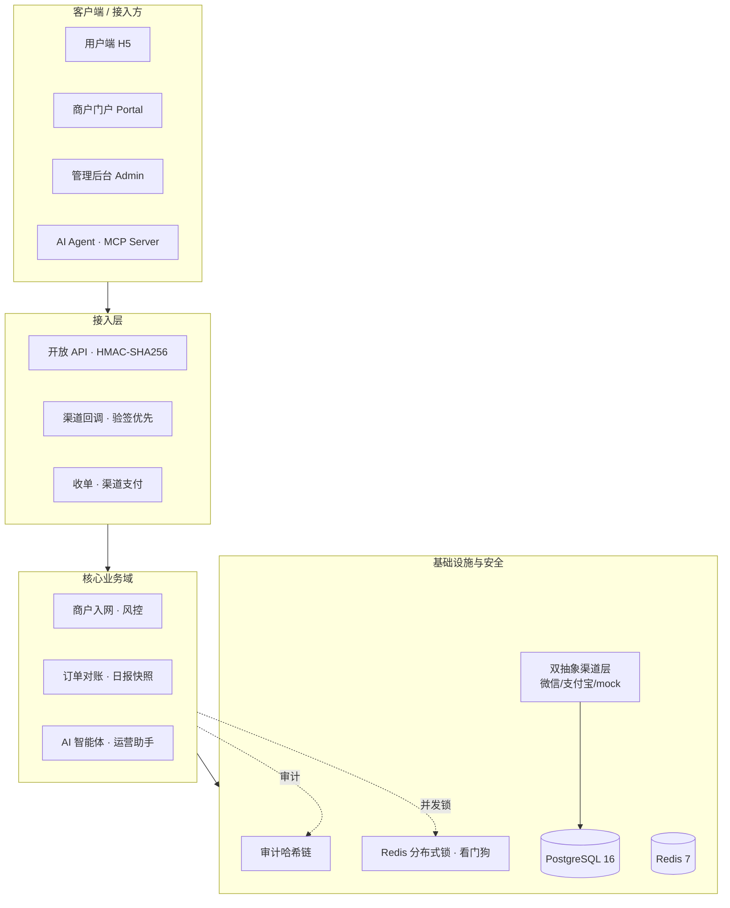

<div align="center">

<p align="center"></p>


# 💳 KeBaiPay 科佰收单

**合规聚合支付技术服务参考实现：收单、开放 API、对账、AI 智能体，资金绝不过平台**

`NestJS 11` · `TypeScript` · `Prisma 7` · `PostgreSQL 16` · `Redis 7` · `Vue 3` · `MCP`

[](docs/CHANGELOG.md)
[](package.json)
[](LICENSE)
[](https://github.com/x33834/KeBaiPay) · [](https://gitee.com/badhope/KeBaiPay)

[](https://x33834.github.io/KeBaiPay/)
[](https://github.com/x33834/KeBaiPay)
[](https://github.com/Morningstar202604/KeBaiPay)
[](https://gitcode.com/badhope/KeBaiPay)
[](https://gitee.com/badhope/KeBaiPay)

[快速开始](#-快速开始) · [系统架构](#-系统架构) · [收单与对账](#-收单与对账) · [界面预览](#-界面预览) · [功能矩阵](#-功能矩阵) · [文档](#-文档) · [镜像仓库](#-镜像仓库)

</div>

<div align="center">

**🌐 语言 / Language / 言語：** [简体中文](README.md) · [English](README.en.md) · [日本語](README.ja.md)

</div>

---

## 📖 这到底是什么

一个**可以私有化部署的合规聚合支付技术服务参考实现**。商户入网审核 + 持牌通道收单（微信/支付宝）+ 订单级对账 + 审计哈希链，**资金全程由持牌支付机构清算，平台不经手任何用户资金**——不设余额、不设充值、不设提现、不设转账、不设红包、不设分账、不设担保。

三条命令跑起来，你就有了一个能收单、能对账、能管商户、还能让 AI 帮你运营的合规聚合技术服务系统。

```bash
git clone https://gitcode.com/badhope/KeBaiPay.git && cd KeBaiPay
cp .env.example .env && docker compose -f docker-compose.dev.yml up -d
npm install && npx prisma migrate deploy && npx prisma db seed && npm run start:dev
```

打开 <http://localhost:3001>。测试账号 `13800000001` / `Abc12345`（付款方用户），管理后台 <http://localhost:3001/admin> 用 `admin` / `ChangeAdmin2026`。

> 国内拉取慢？仓库已托管在 GitCode / Gitee 镜像，见 [镜像仓库](#-镜像仓库)。

---

## 🏗 系统架构


```mermaid
flowchart TB
    subgraph Client["客户端 / 接入方"]
      H5["用户端 H5"]
      Portal["商户门户 Portal"]
      Admin["管理后台 Admin"]
      MCP["AI Agent · MCP Server"]
    end
    subgraph Gateway["接入层"]
      OpenAPI["开放 API · HMAC-SHA256"]
      Webhook["渠道回调 · 验签优先"]
      Cashier["收银台 / 收款码"]
    end
    subgraph Core["核心业务域"]
      Cashier["收单 · 渠道支付"]
      Merchant["商户入网 · 风控"]
      Reconcile["订单对账 · 日报快照"]
      Agent["AI 智能体 · 运营助手"]
    end
    subgraph Infra["基础设施与安全"]
      Ledger["审计哈希链"]
      Lock["Redis 分布式锁 · 看门狗"]
      Channel["双抽象渠道层\n微信/支付宝/mock"]
      DB[("PostgreSQL 16")]
      Cache[("Redis 7")]
    end
    Client --> Gateway --> Core --> Infra
    Channel --> DB
    Core -. 审计 .-> Ledger
    Core -. 并发锁 .-> Lock
```

**四层并发防御**（同一笔订单不会被重复确认/重复入账）：分布式锁解决并发进入 → 数据库事务解决中间态 → 条件原子更新 `updateMany` 解决并发写入 → 幂等键唯一约束解决回调重试。每一层变更都有测试兜底。

---

## 🎯 它能做什么

| 你是谁 | 你能拿走什么 |
|---|---|
| **想搞懂支付系统的工程师** | 收单链路的完整范本：Redis 分布式锁（看门狗续期）→ 事务 → 条件原子更新 → 幂等键唯一约束，四层并发防御；防篡改审计哈希链；渠道账单与订单逐笔对账 |
| **需要收款能力的独立开发者** | 微信/支付宝/mock 多渠道连接器、HMAC 开放 API、零依赖 Node SDK、开箱即用的收银台与收款码 |
| **在探索 Agentic Payments 的团队** | 内置 MCP Server，让 Claude / Cursor 安全地替你运营：scope 授权 + 限额 + 二次确认 + 全链路审计 |

### 核心能力

- **合规资金链路** — 平台不设资金池：无余额/充值/提现/转账/红包/分账/担保，资金由持牌通道直接清算；退款原路退回，订单级对账与日报快照交叉核对
- **审计哈希链** — 管理操作全量上链，每条日志带前序哈希，用 `pg_advisory_xact_lock` 防分叉；改一条日志，后面全断
- **密钥治理** — 渠道凭据 AES-256-GCM 信封加密落库，`appSecret` 只存 SHA-256，敏感字段按字段名白名单脱敏
- **双抽象渠道层** — PaymentChannel（官方 SDK）+ Connector 路由（重试幂等门控），接新渠道只需实现接口
- **开放 API 对标商用网关** — HMAC-SHA256 + 时间窗 + nonce 防重放 + `timingSafeEqual` + Webhook 指数退避 + SSRF 加固
- **多渠道对账聚合** — 自动拉单 → 匹配 → 差异工作流 → CSV 导出
- **AI Agent 层** — Vercel AI SDK 接任意 OpenAI 兼容模型，内置 MCP Server 与独立 stdio 进程两种形态
- **可观测性** — Prometheus `/metrics`、OpenTelemetry 零开销接入、结构化日志 traceId 全链路

---

## 🔐 收单与对账（重点）

支付系统最怕两件事：**订单算错** 和 **回调被刷穿**。以下能力均已落地并配测试，是本项目的核心卖点。

| 防护 | 做法 | 效果 |
|---|---|---|
| **掉单自愈（PENDING 自动补单）** | 定时任务对超时收单订单主动查渠道，与回调共用同一把分布式锁 | 渠道回调丢失也能自动确认；**金额不符/缺失一律拒绝确认（fail-closed）** |
| **全平台支付密码/身份证统一校验** | 11 个入口复用同一套 `@IsPayPassword` / `@IsIdCard` / `@IsSafeText` 装饰器 | 一处规则，全平台一致，杜绝绕过 |
| **金额边界 + 凭证长度** | DTO 加 `@Min/@Max/@IsNumber({maxDecimalPlaces:2})`；42 处凭证/内部 ID 补 `@MaxLength` | 拒绝亚分金额与超界参数，规避 bcrypt 输入边界 DoS |
| **Webhook 验签优先** | 验签在幂等检查**之前**，伪造回调无论订单状态一律 400 | 重放已终态订单的伪造回调不再被幂等缓存放行 |
| **渠道账单逐笔对账** | 定时拉取渠道官方账单 → 与平台收单订单逐笔匹配 → 差异工作流 → CSV 导出 | 单边、错账、漏单全部暴露在差异表里，不会静默落账 |

> 资金路径上有一条**不可绕过的硬规则**：回调/查单返回的金额必须与订单金额完全一致，否则 fail-closed 拒绝确认——任何单边、错账都不会静默落账。

> **生产部署关键配置**：`CHANNEL_NOTIFY_URL`（收单渠道回调地址）必须配置为外网可访问的完整 `http(s)://` URL，生产环境校验器会拒绝 localhost 或缺失值。详见 [.env.example](.env.example) 与 [部署文档](docs/DEPLOYMENT.md)。

---

## 🖼 界面预览


<details open>
<summary><b>管理后台 Admin</b></summary>

| 用户管理 | 商户管理 | 支付订单 |
|---|---|---|
|  |  |  |
| 财务总览 | 风控事件 | 管理后台登录 |
|  |  |  |

</details>

<details>
<summary><b>用户端 H5</b></summary>

| 登录 | 账单 | AI 助手 |
|---|---|---|
|  |  |  |

</details>

<details>
<summary><b>商户门户 Portal</b></summary>

| 数据看板 | 应用密钥 | 订单管理 |
|---|---|---|
|  |  |  |
| 收款码 | 对账查询 | 商户资料 |
|  |  |  |

</details>

---

## 💡 为什么值得一看

市面上支付相关的开源项目，要么是 SDK 封装（只解决"怎么调接口"），要么是电商系统的一个支付模块（只解决"怎么跳收银台"）。**真正把收单、对账、风控、密钥治理讲清楚的，很少。**

这个项目里几个可能对你有参考价值的地方：

- **并发防御是分层的，不是靠一把锁打天下** — 锁解决并发进入，条件原子更新解决并发写入，幂等键唯一约束解决回调重试，事务隔离解决中间态。四层各自解决不同问题，改任何一层都有测试兜底。
- **对账是强制的** — 渠道官方账单与平台订单逐笔匹配，差异进工作流。很多系统的"对账"其实只是一张流水表，对不上账时无从查起。
- **审计链是防篡改的** — 每条日志带前序哈希，用数据库 advisory lock 防分叉。改一条日志，后面全断。
- **AI 操作是有闸门的** — MCP 工具不是"AI 想干嘛干嘛"，而是 scope 授权 + 单笔/日限额 + 二次确认，每次调用都进审计链。

也有没做完的地方，不藏着：**Stripe / 银联 Connector 目前是骨架**，更多渠道与多币种在路线图上。

---

## 📊 功能矩阵

| 能力域 | 状态 | 能力域 | 状态 |
|---|---|---|---|
| 持牌通道收单（微信/支付宝/mock） | ✅ | 多渠道对账聚合 | ✅ |
| 商户入网审核 + 实名 | ✅ | 退款原路退回 | ✅ |
| 商户入驻/应用/Webhook 重试 | ✅ | 订单级日报快照 | ✅ |
| 开放 API + 零依赖 Node SDK | ✅ | 优惠券 / 发票 | ✅ |
| 微信/支付宝官方 SDK 直连 | ✅ | 收单掉单自动补单 | ✅ |
| 平台不设资金池（合规） | ✅ | 审计哈希链 | ✅ |
| AI Agent + MCP + 二次确认 | ✅ | Stripe / 银联 Connector | 🚧 骨架 |
| KYC 双端 UI / 渠道配置中心 | ✅ | 小程序 SDK / 多币种 | 📋 规划中 |

---

## 📚 文档

| 入门 | 深入 | 运维 |
|---|---|---|
| [快速开始](docs/QUICKSTART.md) | [开发指南](docs/DEVELOPER_GUIDE.md) | [生产部署](docs/DEPLOYMENT.md) |
| [API 参考](docs/API_REFERENCE.md) | [合规模式说明](docs/COMPLIANCE_MODE.md) | [上线检查清单](docs/PRODUCTION_READINESS.md) |
| [SDK 指南](docs/SDK_GUIDE.md) | [代码健康报告](docs/CODE_HEALTH_REPORT.md) | [故障排查](docs/TROUBLESHOOT.md) |
| [用户手册](docs/USER_MANUAL.md) | [版本管理规范](docs/VERSIONING.md) | [更新日志](docs/CHANGELOG.md) |
| [用户服务协议](docs/legal/user-agreement.md) | [隐私政策](docs/legal/privacy-policy.md) | [商户服务协议](docs/legal/merchant-agreement.md) |
| [退款与争议规则](docs/legal/refund-policy.md) | [合规声明](docs/legal/compliance-statement.md) | [商业授权](docs/legal/commercial-license.md) |

- 完整 OpenAPI 3.0 规范（**136 个操作 / 121 条路径**，与代码实测一致）：[`docs/openapi.json`](docs/openapi.json)
- 商户 5 步接入第一笔收款：见 [QUICKSTART](docs/QUICKSTART.md)

---

## 🌏 镜像仓库

四平台并列同步维护（分支 / 标签 / HEAD 完全一致），内容相同，任选其一，不偏心任何一个：

| 平台 | 地址 |
|---|---|
| **GitHub** | [x33834/KeBaiPay](https://github.com/x33834/KeBaiPay) |
| **GitHub** | [Morningstar202604/KeBaiPay](https://github.com/Morningstar202604/KeBaiPay) |
| **GitCode** | [badhope/KeBaiPay](https://gitcode.com/badhope/KeBaiPay) |
| **Gitee** | [badhope/KeBaiPay](https://gitee.com/badhope/KeBaiPay) |

**🌐 官方网站**（GitHub Pages 双号部署，内容一致）：<https://x33834.github.io/KeBaiPay/> · <https://morningstar202604.github.io/KeBaiPay/>

---

## 🤝 参与贡献

提 PR 前请确保 `npm run lint && npx jest --maxWorkers=4` 全绿。发版遵循 [SemVer 纪律](docs/VERSIONING.md)，贡献指南见 [CONTRIBUTING.md](CONTRIBUTING.md)。

安全漏洞请走 [SECURITY.md](SECURITY.md) 私下披露，不要开公开 issue。

---

## ⚠️ 关于合规

代码是 MIT 的，随便用。**本系统按"合规聚合技术服务商"模式设计：平台本身不经手任何用户资金，不设余额/充值/提现/转账/红包/分账/担保，所有资金清算由持牌支付机构完成。** 但在中国大陆实际对外营业仍需取得相应支付业务资质或与持牌机构合规合作——这是运营资质问题，不是许可证能解决的。默认只启用 mock 渠道，想违规营业都跑不起来。

生产部署前请读 [合规模式说明](docs/COMPLIANCE_MODE.md) 与 [上线清单](docs/PRODUCTION_READINESS.md)。

---

## 📄 许可证

[MIT](LICENSE) — 自由使用、修改、分发，包括商业用途。

---

<div align="center">

如果这个项目帮你省下了几个通宵，或者让你终于搞懂了某段收单链路，**点个 Star ⭐ 就是最好的反馈**。

也欢迎把它分享给可能需要的朋友——好东西被看见，才有继续维护的动力。

<sub>Built with care by KeBaiPay Contributors · v0.3.5</sub>

</div>
