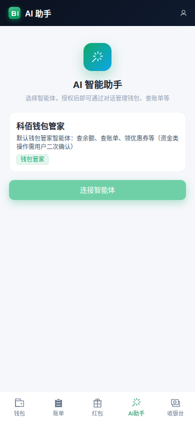
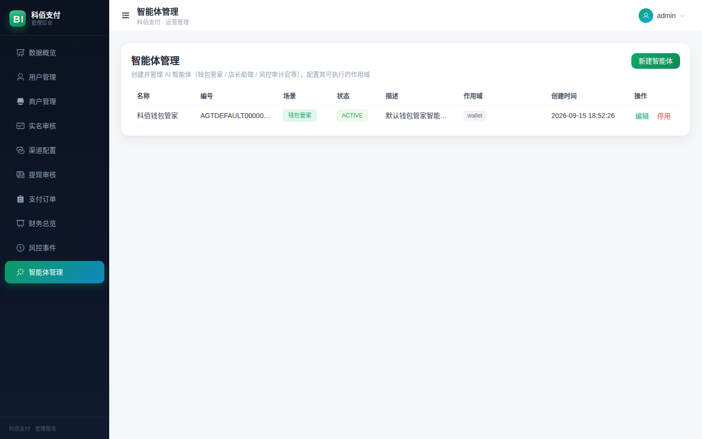

# KeBaiPay 演示与功能走查

> KeBaiPay 的**可视化功能演示**：三端逐步截图 + 分端录屏 + 精编合集视频。
> 录制环境：本地 `NODE_ENV=development` + mock 渠道 + 演示数据。
> 复现：`node scripts/capture-demo.mjs`（需 playwright + chromium）。

## 🎬 演示视频

| 端 | 视频 | 内容 |
|----|------|------|
| **精编合集（推荐）** | [`videos/kebaipay-showcase.mp4`](videos/kebaipay-showcase.mp4) | **标题卡 + 三端精华**（商户后台 → 用户H5 → 管理后台），场景淡入过渡，H.264 统一 1440×900 |
| 商户后台 | [`videos/portal-demo.webm`](videos/portal-demo.webm) | 登录 → 数据看板 → 订单管理 → 对账 → 收款码 → 应用 → 商户资料 |
| 用户 H5（钱包） | [`videos/h5-demo.webm`](videos/h5-demo.webm) | 登录 → 首页余额 → AI助手 → 充值 → 红包 → 收银台 → 账单 |
| 管理后台 | [`videos/admin-demo.webm`](videos/admin-demo.webm) | 登录 → 数据概览 → 用户 → 商户 → 提现审核 → 订单 → 财务 → 风控 → 智能体 |
| 管理员审核交互 | [`videos/admin-review.webm`](videos/admin-review.webm) | 管理员登录 → 提现审核列表 |

> 使用与配置总指南：[docs/USER_CONFIGURATION_GUIDE.md](../docs/USER_CONFIGURATION_GUIDE.md)

## 🔑 演示账号

| 角色 | 账号 | 密码 | 入口 |
|------|------|------|------|
| 商户用户 | `13800000001` | `Abc12345`（支付密码 `123456`） | `/portal`、`/h5` |
| 管理员 | `admin` | `Admin2026` | `/admin` |

> 商户已入驻并审核通过（"MVP演示商户"），余额 ¥10000，8 笔订单，3 个智能体（钱包/店长/风控）。

---

## 一、商户后台（`/portal`）

| 视图 | 截图 |
|------|------|
| 登录 |  |
| 数据看板（今日/近7天/近30天交易额、净收入） |  |
| 订单管理（筛选 + 回调状态 + 重试回调） |  |
| 对账查询 |  |
| 收款码 |  |
| 应用管理 |  |
| 商户资料 |  |

## 二、用户 H5 钱包（`/h5`）

| 视图 | 截图 |
|------|------|
| 登录 |  |
| 首页（余额 + 快捷操作 + 最近账单） |  |
| AI 智能助手（选智能体→授权→对话） |  |
| 充值 |  |
| 红包 |  |
| 收银台 |  |
| 账单 |  |

## 三、管理后台（`/admin`）

| 视图 | 截图 |
|------|------|
| 登录 |  |
| 数据概览 |  |
| 用户管理 |  |
| 商户管理 |  |
| 提现审核 |  |
| 支付订单 |  |
| 财务总览 |  |
| 风控事件 |  |
| 智能体管理 |  |

---

## 说明

演示使用 **mock 支付渠道 + 演示数据**（联调用）；真实资金进出按 `docs/EXTERNAL_QUICKSTART.md` 接入真实渠道。
