# KeBaiPay 演示与功能走查

> KeBaiPay 的**可视化功能演示**：三端逐步截图 + 分端录屏 + 精编合集视频。
> 录制环境：本地 `NODE_ENV=development` + mock 渠道 + 演示数据。
> 本平台为**合规聚合收单技术服务**：资金绝不过平台，不设余额/充值/提现/转账/红包/分账/担保。

## 🎬 精编合集（推荐直接看这个）

  <video src="videos/kebaipay-showcase.mp4" controls width="720" poster="videos/showcase-preview.gif"></video>

  

## 📼 分端视频

| 端 | 视频 | 内容 |
|----|------|------|
| **精编合集（推荐）** | [`videos/kebaipay-showcase.mp4`](videos/kebaipay-showcase.mp4) | **标题卡 + 三端精华**（商户后台 → 用户H5 → 管理后台），场景淡入过渡，H.264 统一 1440×900 |
| 管理后台 | [`videos/admin-demo.webm`](videos/admin-demo.webm) | 登录 → 数据概览 → 用户 → 商户 → 实名审核 → 订单 → 财务 → 风控 → 智能体 |

> 使用与配置总指南：[docs/USER_CONFIGURATION_GUIDE.md](../docs/USER_CONFIGURATION_GUIDE.md)

## 🔑 演示账号

| 角色 | 账号 | 密码 | 入口 |
|------|------|------|------|
| 付款方用户 | `13800000001` | `Abc12345`（支付密码 `123456`） | `/portal`、`/h5` |
| 管理员 | `admin` | `ChangeAdmin2026` | `/admin` |

> 商户已入驻并审核通过（"MVP演示商户"），含若干收单订单、智能体（店长/风控等）。平台不持有任何用户资金。

---

## 一、商户后台（`/portal`）

| 视图 | 截图 |
|------|------|
| 登录 | 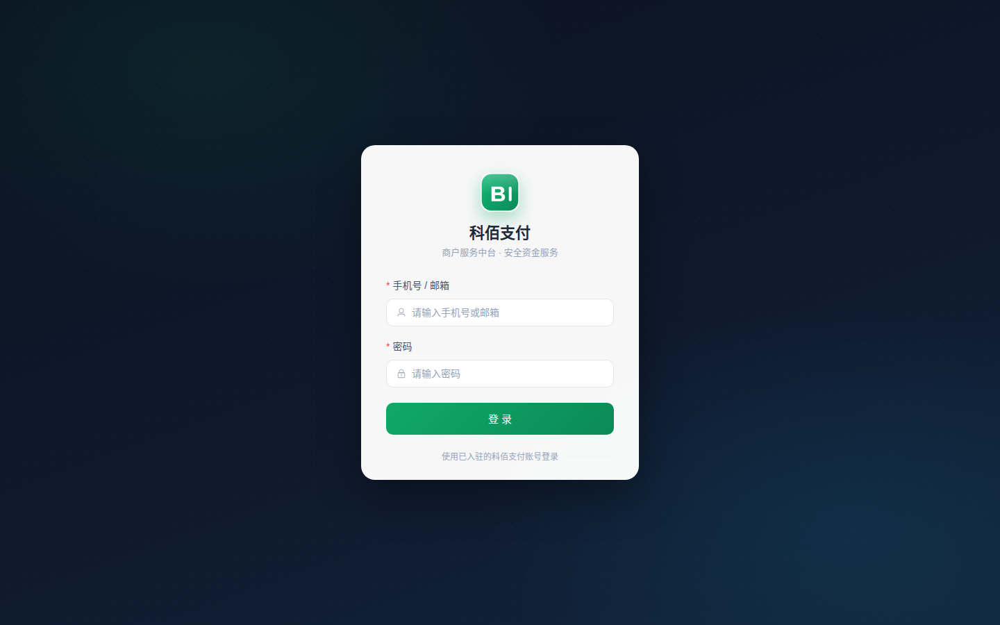 |
| 数据看板（今日/近7天/近30天收单额、手续费） | 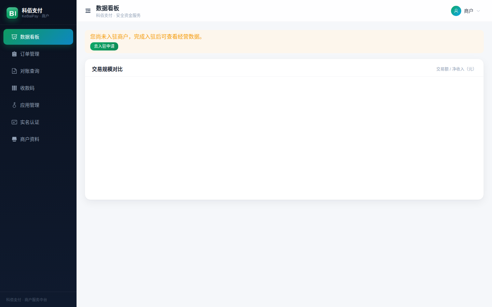 |
| 订单管理（筛选 + 回调状态 + 重试回调） | 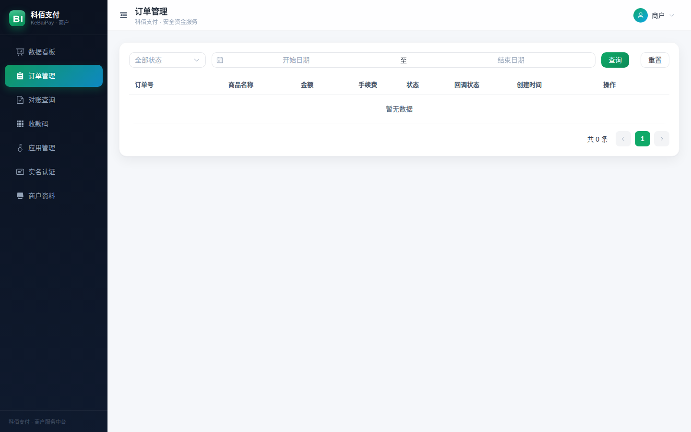 |
| 对账查询 | 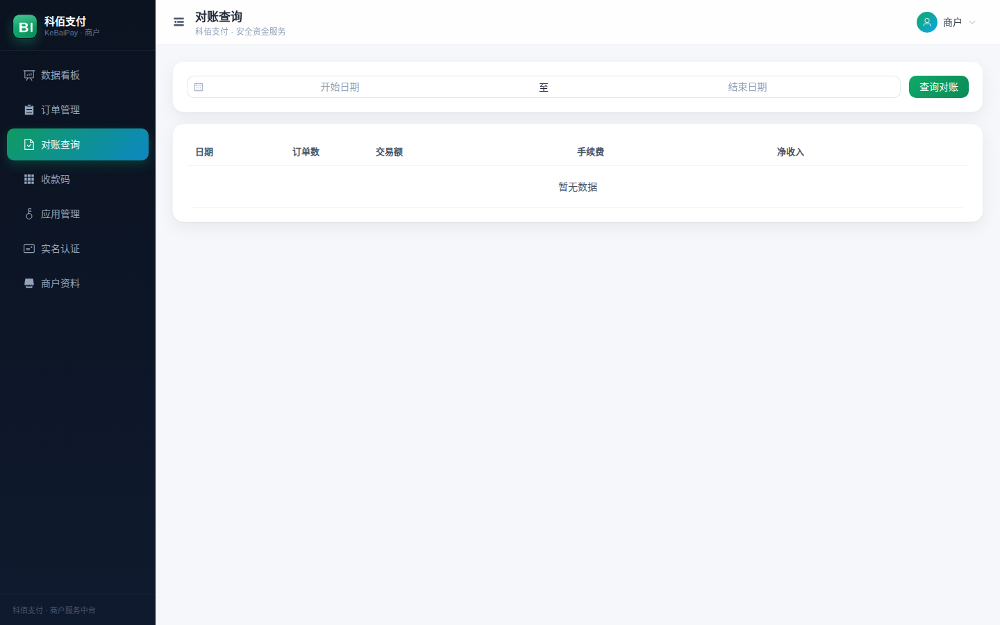 |
| 收款码 | 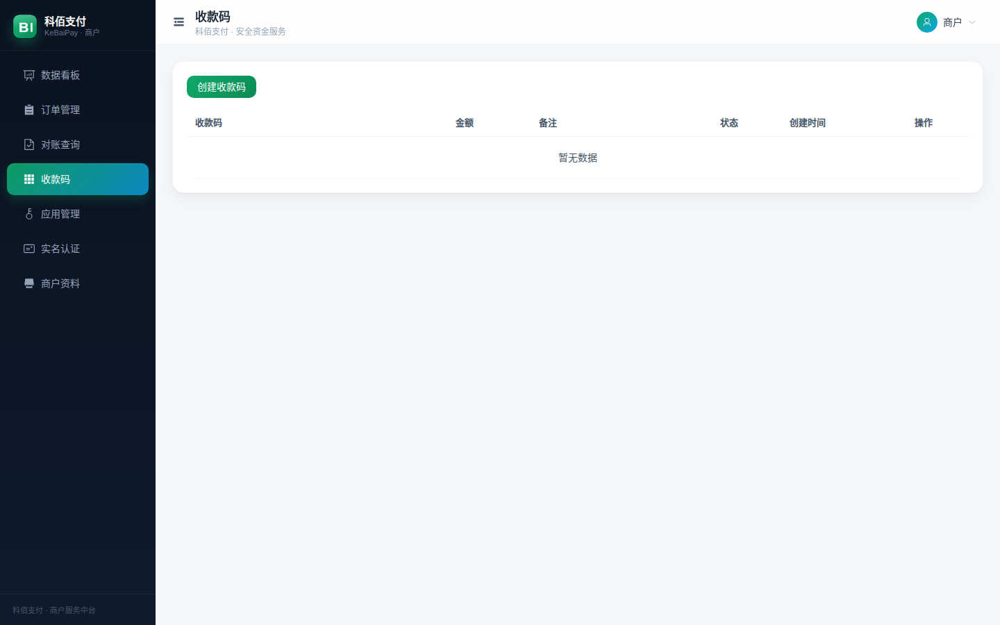 |
| 应用管理 | 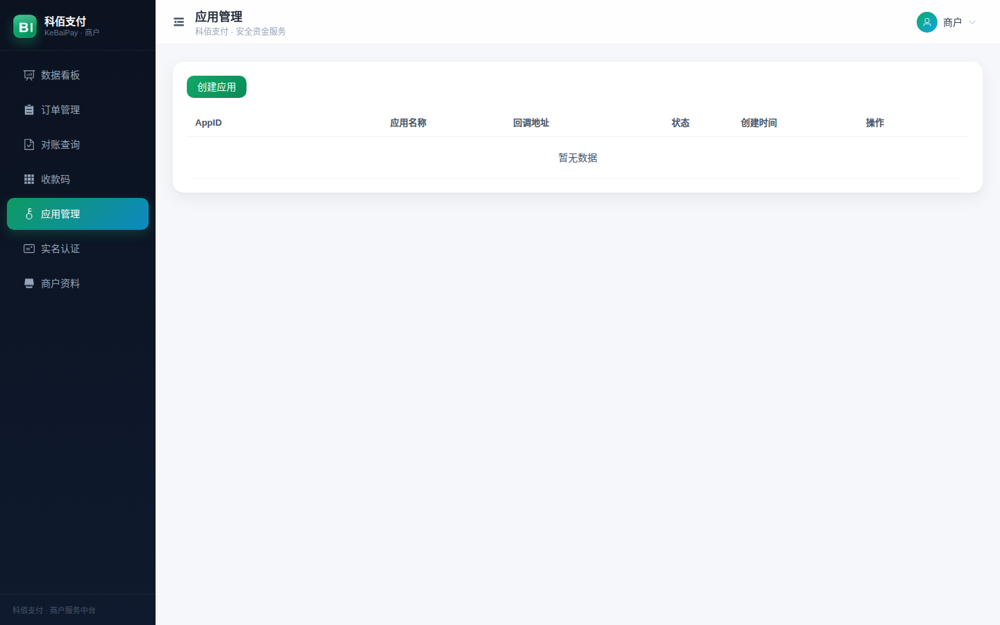 |
| 商户资料 | 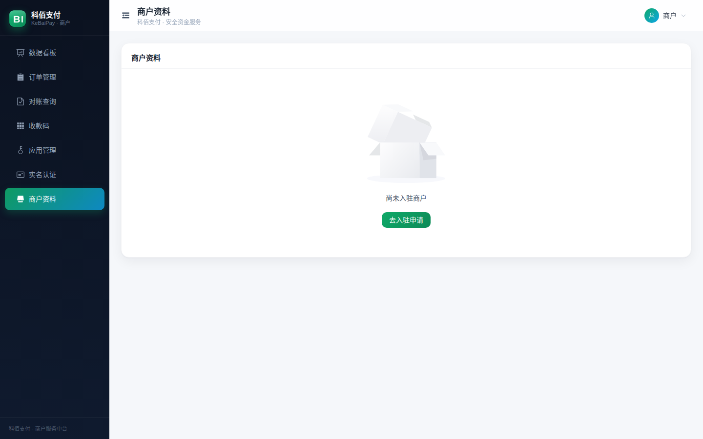 |

## 二、用户 H5（`/h5`）

| 视图 | 截图 |
|------|------|
| 登录 | 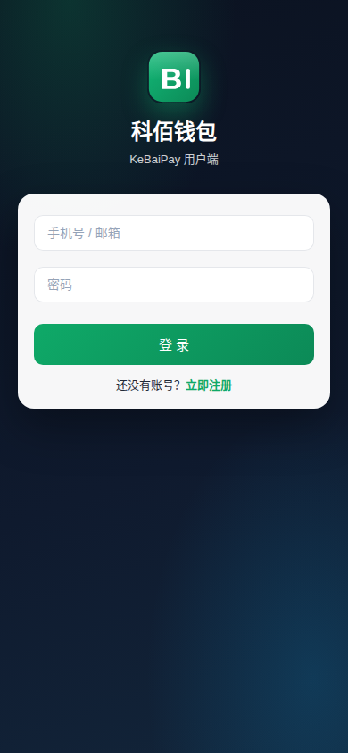 |
| AI 智能助手（选智能体→授权→对话） |  |
| 账单 | 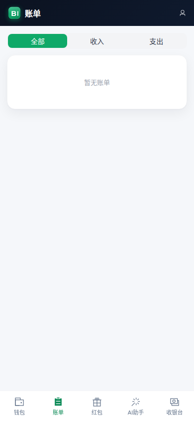 |

## 三、管理后台（`/admin`）

| 视图 | 截图 |
|------|------|
| 登录 | 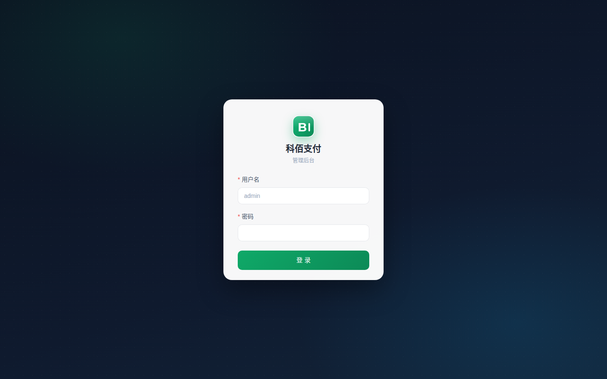 |
| 用户管理 | 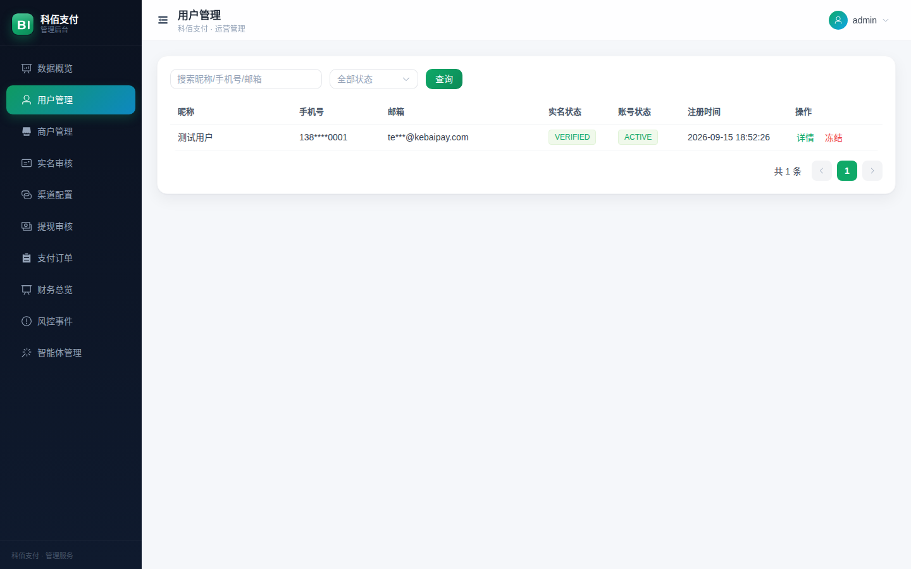 |
| 商户管理 | 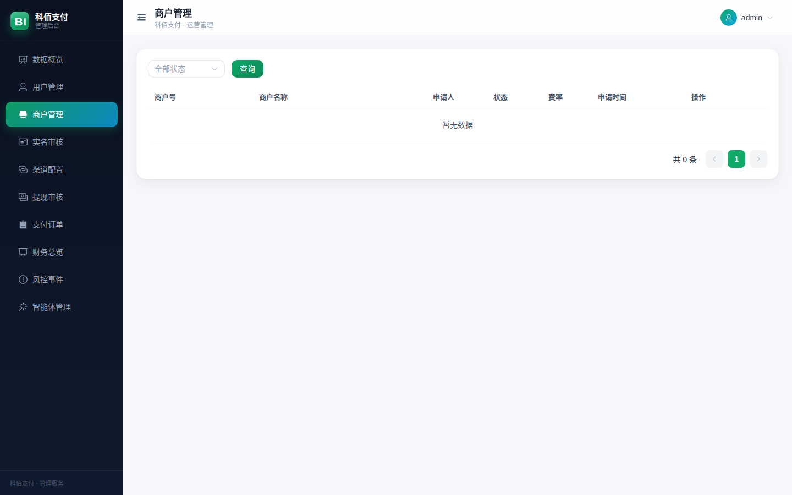 |
| 实名审核 |  |
| 支付订单 | 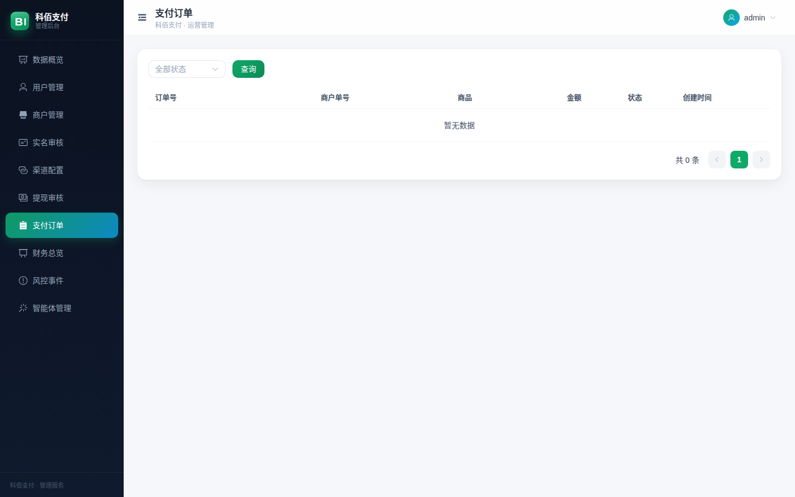 |
| 财务总览 | 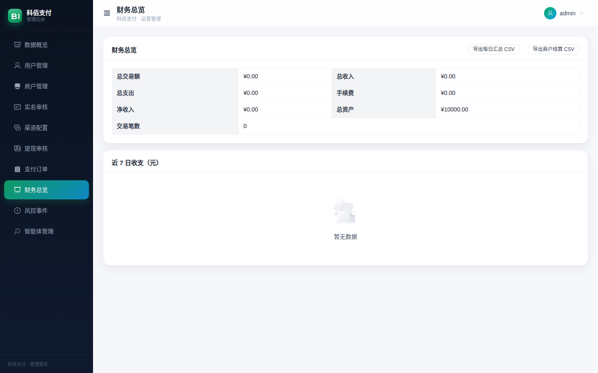 |
| 风控事件 | 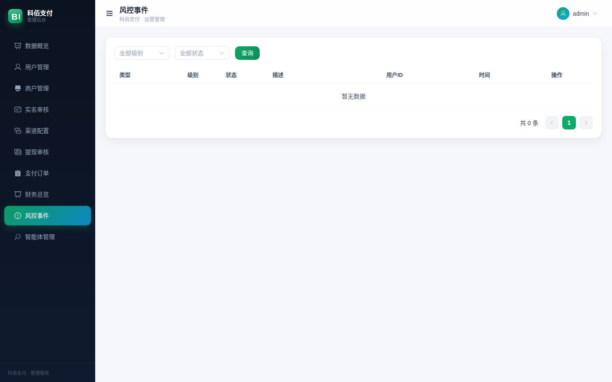 |

---

## 说明

演示使用 **mock 支付渠道 + 演示数据**（联调用）；真实资金进出按 `docs/EXTERNAL_QUICKSTART.md` 接入真实持牌渠道。
